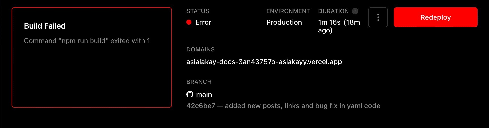
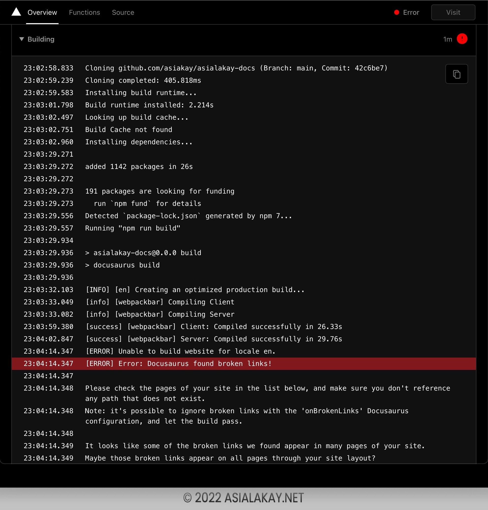
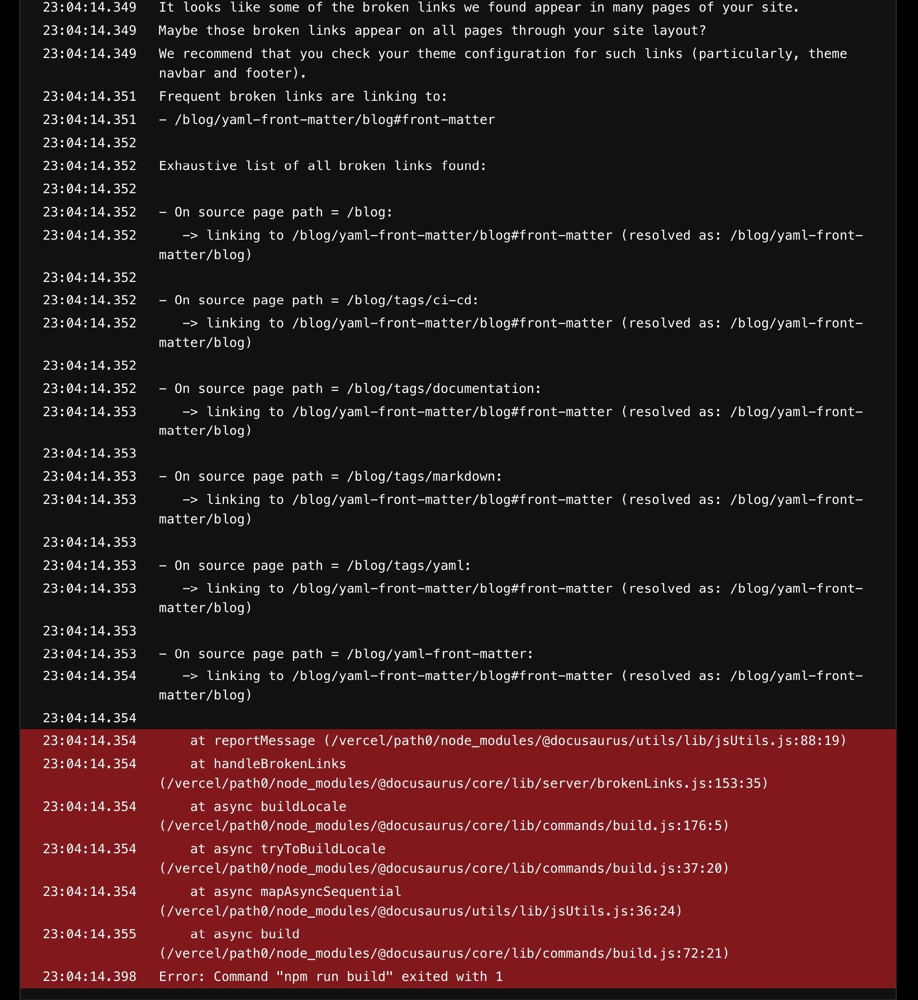
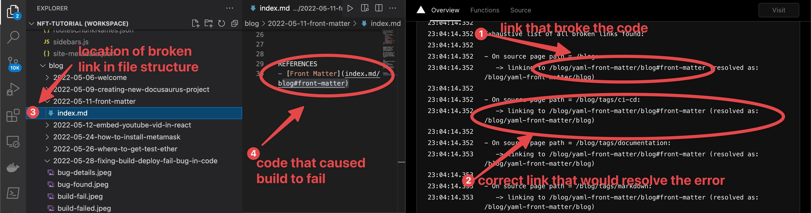
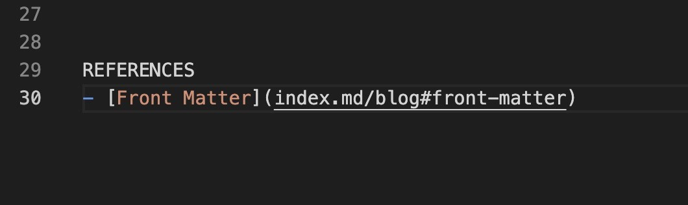
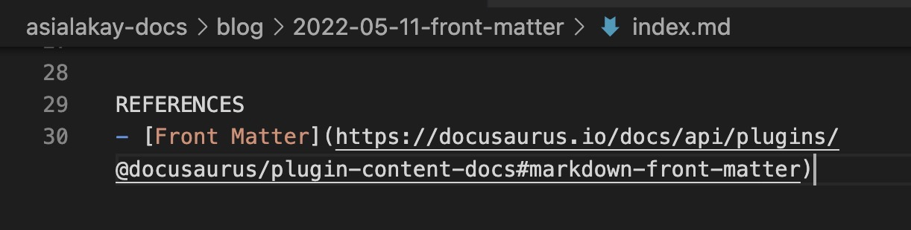
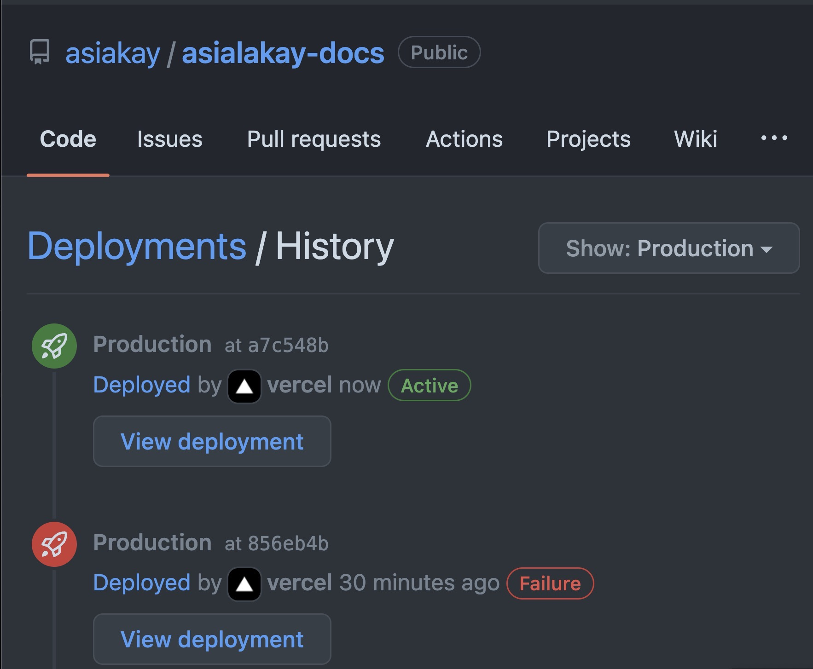
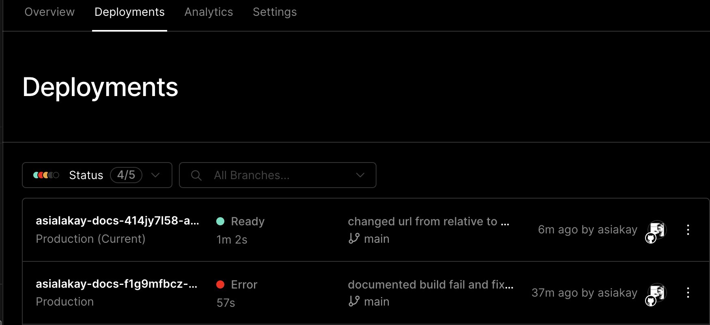

Found the bug!

Issues are 1) there is a hashtag symbol where there should be a forward slash, 2) front matter slug has been changed, but mainly 3) the **url is pointing to the old relative url slug that is shipped with the docusaurus default dev environment**.

Bug is not fixed by pointing to resolved 

Here's how the bug was fixed. The link was changed to a point to info about Front Matter within the docusaurus developer reference documentation.

Gitub Deployment Status

Vercel Production Build Status (Ready = SUCCESS)

