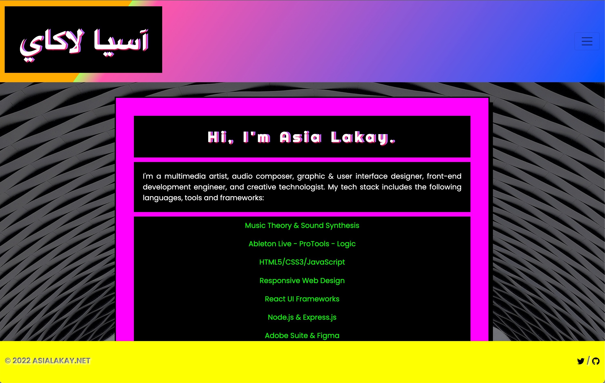
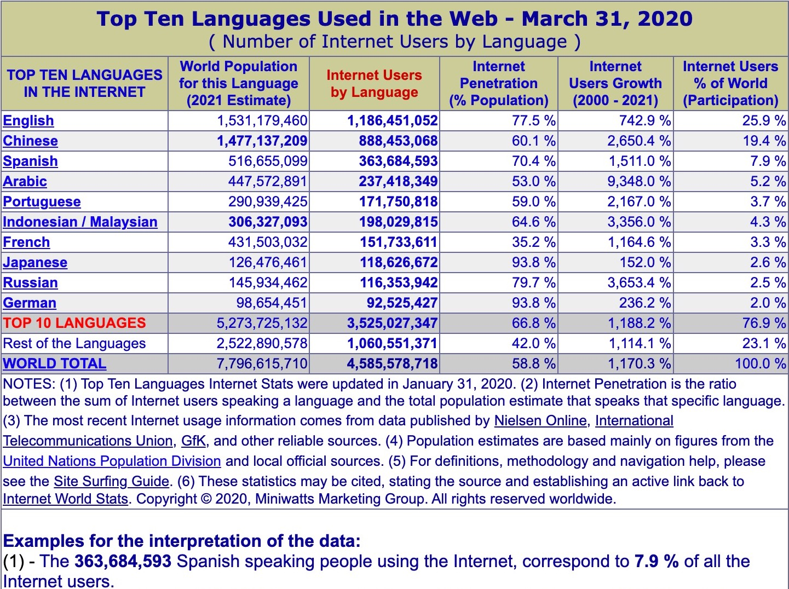
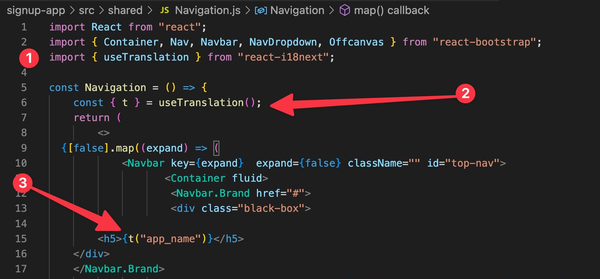
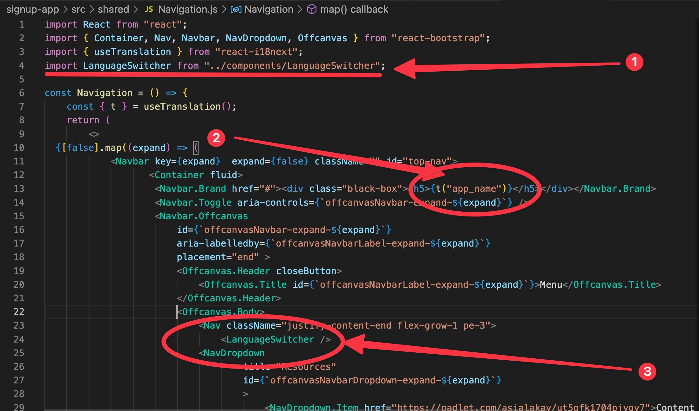
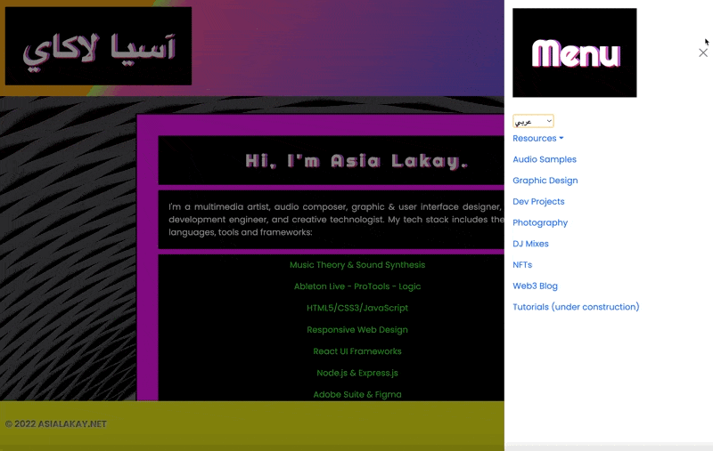
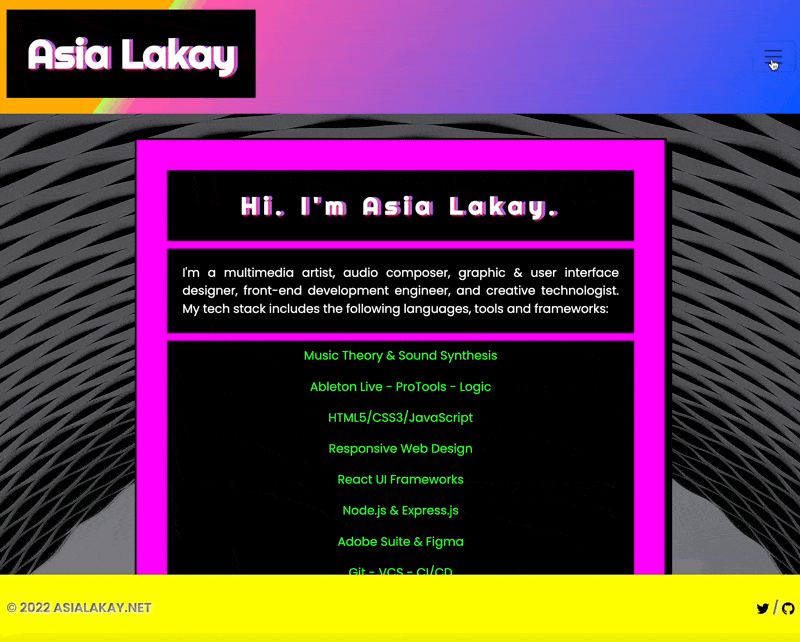

I've been interested foreign languages for as long as I can remember. One summer, I decided to take an Arabic course at the city community college. Our professor described what it meant to greet a person in the person's native language. She called it a bridge and a way to build a positive connection. This resonated. Naturally, when I learned that there was a way to do this with code in React applications, I started to learn this functionality to add it to a User Story for Asialakay.net. This way, when visitors arrived to the site, they might be greeted in their native language. 


[source: internetworldstats.com](https://www.internetworldstats.com/stats7.htm)

**USER STORY**

- Users will have the option to change the language via language switcher. 


**DEV NOTES**

I decided on i18next. 

It requires node to be installed. 

Checking that node is installed as well as the version. 

```Bash
(base) @mbp signup-app %node -v
v16.15.0
```

Required Dependencies
- [x] [i18next](https://www.i18next.com/)
- [x] [react-i18next](https://react.i18next.com/)
- [x] [i18next-browser-languagedetector](https://github.com/i18next/i18next-browser-languageDetector)

`npm install i18next react-i18next i18next-browser-languagedetector`

Set Up and Installation
- [x] Create an i18n.js file to bootstrap an i18next instance

```JSX
import i18next from "i18next";
import { initReactI18next } from "react-i18next";


// "Inline" English, Arabic and Chinese translations. 
// localization is available for any language and any number of languages.
const resources = {
    en: {
        translation: {
            app_name: "Asia Lakay",
        },
    },
    ar: {
        translation: {
            app_name: "آسيا لاكاي",
        },
    },
    ch: {
        translation: {
            app_name: "亞拉凱"
        }
    }
};

i18next 
// passes the i18n instance to react-i18next
.use(initReactI18next)
// init i18next
// view configuration options @ https://www.i18next.com/overview/configuration-options
.init({
    resources,
    lng: "ar",
    interpolation: {
        escapeValue: false,
    },
});
   
export default i18next;
```

- [x] import i18n file into index.js for webpack bundling

```JSX
import React from 'react';
import { createRoot } from 'react-dom/client';
// import ReactDOM from 'react-dom';
import App from './App';
import "bootstrap/dist/css/bootstrap.min.css";
import "../src/style.scss";
import './services/i18n';


const root = createRoot(document.getElementById('root'))
root.render(
  <React.StrictMode>
    <App />
  </React.StrictMode>
);
```

- [x] add import statement for react-i18next's `useTranslation` hook providing access to i18next's `t()` function
- [x] bind the `t()` function var to the `useTranslation` hook, associating it's string key to the paired active language translation from the `resources` object in the `i18n.js` file
- [x] call the `t()` function's key value with the parameter `("app_name")`  to change the app name in the `<h5>` tag within the `<Navbar.Brand>` 


**TESTING 1, 2, 3**

`npm start`


- [x] Keep the app running quickly by adding Lazy Loading allowing only the current active translation file to load. 
    - [x] `npm install --save i18next-http-backend`
    - [x] add `import HttpApi from "i18next-http-backend";` statement to top of i18n.js file
    - [x] add another instance of the `use()` function to register the `(HttpApi)` plugin from `"i18next-http-backend"` module to i18next 
    - [x] remove the `resources` object from `i18next` const in `i18n.js` file because we can now load translations from the server as needed
    - [x] add the translation files to the location that the back-end plugin expects them to be by default: `public/locales/{{lng}}/{{ns}}.json` meaning `{{lng}}` is the language code, and `{{ns}}` is the namespace. As this is an introduction, the default namespace, `translation` will suffice. 
    - [x] add Suspense boundary around `<App>` to prevent error while rendering.

***

### Building the Language Switcher Component ### 
- [x] In `src/components/LanguageSwitcher.js`, we added a React component that allows the user to change the active language to the one of their choice.  
    - its code accessed the `.language` property value of `i18n` const through the `<select>` tag. (The `.language` property can either 1) detect the current language, or 2) set a language based on the option selected. For using the primary language based on the configuration defined in the i18n.js file, use `.i18next.languages[0]`.)

```JSX
import React from "react";
import { useTranslation } from "react-i18next";

function LanguageSwitcher(){
    const { i18n } = useTranslation();

    return (
        <div className="select">
            <select
                value={ i18n.language}
                onChange=
                { (e) =>
                i18n.changeLanguage (e.target.value)}
            >
                <option value="en">English</option>
                <option value="ar">عربي</option>
            </select>
        </div>
    );
}

export default LanguageSwitcher;
```

- In `src/components/Navbar.js`, 
    - [x] added import statement to top of file
    - [x] reviewed `t()` function parameter key/value 
    - [x] added `<LanguageSwitcher>` React Component to the Navbar Menu





### Changed the layout direction with language selection: left-to-right & right-to-left ###

- In`src/App.js`
    - imported `useEffect` hook from React with `import React, {useEffect} from "react";`
    - added `import { useTranslation } from "react-i18next";`
    - added the code below to assign variables, react hooks, and properties in the `App.js` file.

    ```JSX
      const { i18n } = useTranslation();
      
      useEffect(() => {
          document.dir = i18n.dir();
          }, [i18n, i18n.language]);
    ```



***Next Step is to Auto-Detect the User's Language***

REFERENCES
- [How to properly internationalize a React application using i18next - Dev.to](https://dev.to/adrai/how-to-properly-internationalize-a-react-application-using-i18next-3hdb)
- [A Guide to React Localization with i18next - Phrase.com](https://phrase.com/blog/posts/localizing-react-apps-with-i18next/)