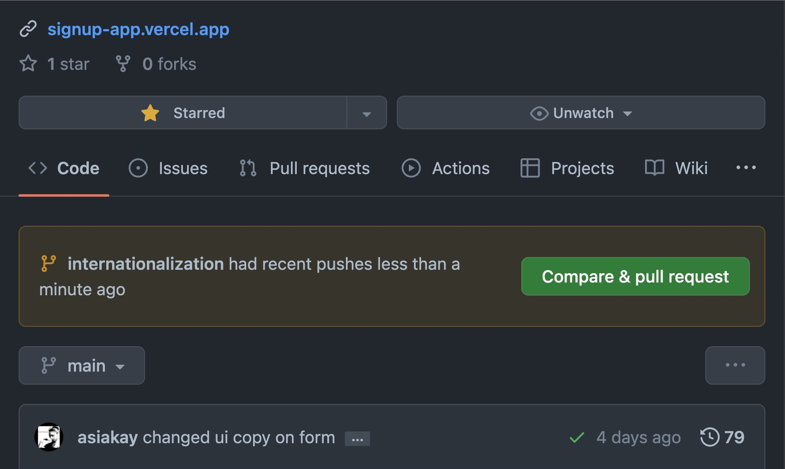
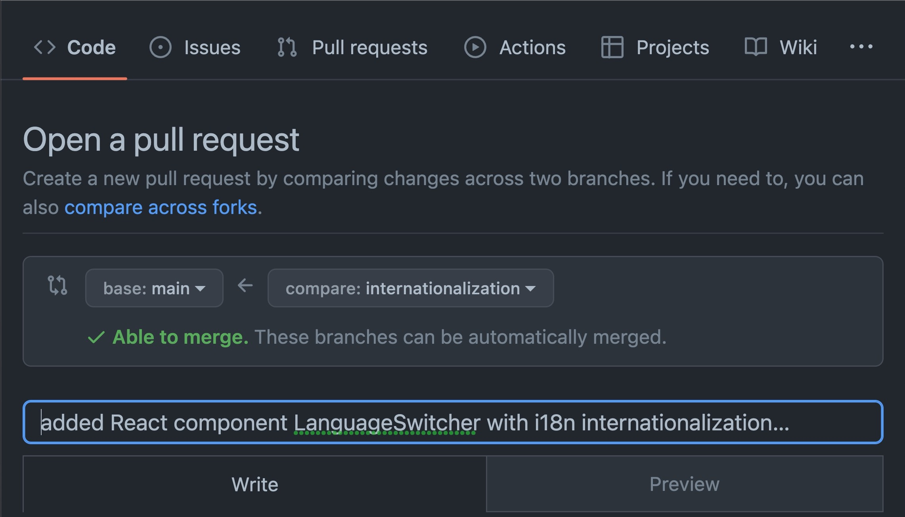

At this stage in my development as a software engineer, I'm happy to confess that I've built up some antibodies to defend against a once paralyzing case of impostor syndrome. While there is always more to learn, it's been encouraging to achieve small wins that remind me of how far I've come since embarking on the challenging journey of becoming an 80% self-taught software engineer. 
 
<!--truncate-->

Here are some of the main things that immune defense to impostor syndrome has helped me to realize and appreciate.

 - 1) There is always going to be more to learn because the community is so creative -  consistently coming out with tools and sources of inspiration.
 - 3) Having clear intentions and working towards specific skills to complete projects has increased my confidence and ability to recognize what needs more practice as I prepare to transition into professional dev work with a project team. 
 - 3) As long as I have an idea of what problem I want to solve, I can always ask a person or a Google search box.
 
However, since I have recently become more assertive in seeking a software engineering position, I realize that I've gotten used to working in a silo of my own commits and pushes to the main branch. 
 
This post is all about **creating a feature branch independent of the main before integrating the new feature into the main branch**. 

By the end of this post, the following outcomes will have been achieved: 

- Creation of a new feature branch to review i18next integration named "Internationalization"

- A clearer and more practical understanding of benefits and what steps are required to iterate over changes more efficiently using version controlled feature branches on Github.

- Production of documentation that might serve as a reference for best practices when developing software for code review, dev environment preview, and maintainence of a more organized codebase.  

With that said, let's begin. I hope this might provide as much value for the reader as it has provided for me as the writer. Feel free to follow along!

1. If needed, clone the project. Type in the terminal: 

(syntax to clone via https:)

`git clone https://github.com/YOUR-USERNAME/YOUR-REPOSITORY`

(code to clone the repository I'm currently working with:)

`git clone https://github.com/asiakay/signup-app.git`

2. Create, name and build the branch to hold the new feature: 

(example command syntax to enter:)

`git checkout -b feature_name`

(command entered to create my new branch:)

`git checkout -b internationalization`

This terminal command returns... 

```Bash
(base) @mbp signup-app %git checkout -b internationalization
M       package-lock.json
M       package.json
M       src/App.js
M       src/Banner.js
M       src/Signup.js
M       src/bot/config.js
M       src/index.js
M       src/shared/Navigation.js
M       src/style.scss
M       yarn.lock
Switched to a new branch 'internationalization'
(base) @mbp signup-app %git status
On branch internationalization
Changes not staged for commit:
  (use "git add <file>..." to update what will be committed)
  (use "git checkout -- <file>..." to discard changes in working directory)

        modified:   package-lock.json
        modified:   package.json
        modified:   src/App.js
        modified:   src/Banner.js
        modified:   src/Signup.js
        modified:   src/bot/config.js
        modified:   src/index.js
        modified:   src/shared/Navigation.js
        modified:   src/style.scss
        modified:   yarn.lock

Untracked files:
  (use "git add <file>..." to include in what will be committed)

        public/locales/
        src/components/LanguageSwitcher.js
        src/services/

no changes added to commit (use "git add" and/or "git commit -a")
(base) @mbp signup-app %
```

3. Write code/ add untracked new files to staging area

- Since the new files and demo internationalization code have already been created, the next step is to add the untracked files with command:

 `git add .` 

- One habit that has become automatic in my workflow is to check the status of the staged files immediatly after adding them to the staging area.

I type `git status` after every `git add .`. 

This output a list of new and modified files waiting in the staging area to be commmited and pushed: 

```Bash
(base) @mbp signup-app %git status
On branch internationalization
Changes to be committed:
  (use "git reset HEAD <file>..." to unstage)

        modified:   package-lock.json
        modified:   package.json
        new file:   public/locales/ar/translation.json
        new file:   public/locales/ch/translation.json
        new file:   public/locales/en/translation.json
        modified:   src/App.js
        modified:   src/Banner.js
        modified:   src/Signup.js
        modified:   src/bot/config.js
        new file:   src/components/LanguageSwitcher.js
        modified:   src/index.js
        new file:   src/services/i18n.js
        modified:   src/shared/Navigation.js
        modified:   src/style.scss
        modified:   yarn.lock

(base) @mbp signup-app %
```

4. Commit and push to Github

- For this example, I typed `git commit -m "added React component LanguageSwitcher with i18n internationalization framework."` into the cli. 

This returns: 

```Bash
[internationalization a790455] added React component LanguageSwitcher with i18n internationalization framework.
 15 files changed, 432 insertions(+), 44 deletions(-)
 create mode 100644 public/locales/ar/translation.json
 create mode 100644 public/locales/ch/translation.json
 create mode 100644 public/locales/en/translation.json
 create mode 100644 src/components/LanguageSwitcher.js
 create mode 100644 src/services/i18n.js
(base) @mbp signup-app %   
```

Next, I typed `git push` to push to githib. But, this returns:

```Bash 
fatal: The current branch internationalization has no upstream branch.
To push the current branch and set the remote as upstream, use

    git push --set-upstream origin internationalization

(base) @mbp signup-app %
```
This command flag `--set-upstream` gives permission to set the default remote branch for the current local branch.

To check the remote server, I typed `git remote -v`. 

This returned, 

```Bash
origin  https://github.com/asiakay/signup-app (fetch)
origin  https://github.com/asiakay/signup-app (push)
(base) @mbp signup-app %
```

... letting me know that the current upstream/push and downstream/fetch is still pointing to the main branch.

Typing, `git branch -a` displays a list currently available branches and in this case returns:

```Bash
(base) @mbp signup-app %git branch -a  
  chatbot
* internationalization
  main
  remotes/origin/HEAD -> origin/main
  remotes/origin/main
(base) @mbp signup-app %
```

The asterisk indicates the branch that we are on, but the line `remotes/origin/HEAD -> origin/main` is still set as the upstream branch. 

Going back to the `fatal:...` message alerting that the "current branch internationalization has no upstream branch"  

I entered the directions indicated in the cli response, and typed `git push --set-upstream origin internationalization`

This command returned the following: 

```Bash
Counting objects: 27, done.
Delta compression using up to 8 threads.
Compressing objects: 100% (22/22), done.
Writing objects: 100% (27/27), 6.54 KiB | 32.00 KiB/s, done.
Total 27 (delta 13), reused 0 (delta 0)
remote: Resolving deltas: 100% (13/13), completed with 13 local objects.
remote: 
remote: Create a pull request for 'internationalization' on GitHub by visiting:
remote:      https://github.com/asiakay/signup-app/pull/new/internationalization
remote: 
To https://github.com/asiakay/signup-app
 * [new branch]      internationalization -> internationalization
Branch 'internationalization' set up to track remote branch 'internationalization' from 'origin'.
(base) @mbp signup-app %
```
... letting me know that the new server branch `internationalization` is ready to track the remote `internationlization` branch from origin. 



As shown in the screenshot above, the code has been committed and pushed to the new feature branch `internationalization` - and at this point is still independent of the main branch.  

5. Review code on commits page 


6. When ready to merge, open a pull request, or a *draft* pull request.



If opening a pull request after navigating away and then returning back to the repository, the screencast below will show where to find the links to start the process.


REFERENCES
- [Cloning a repository - Github.com](https://docs.github.com/en/repositories/creating-and-managing-repositories/cloning-a-repository)

- [Feature branch workflow - Gitlab.com](https://docs.gitlab.com/ee/gitlab-basics/feature_branch_workflow.html)

- [Upstream and Downstream - Javatpoint.com](https://www.javatpoint.com/git-upstream-and-downstream)