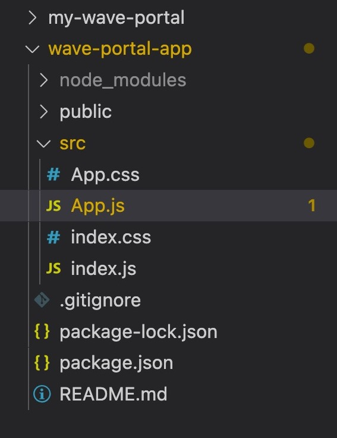
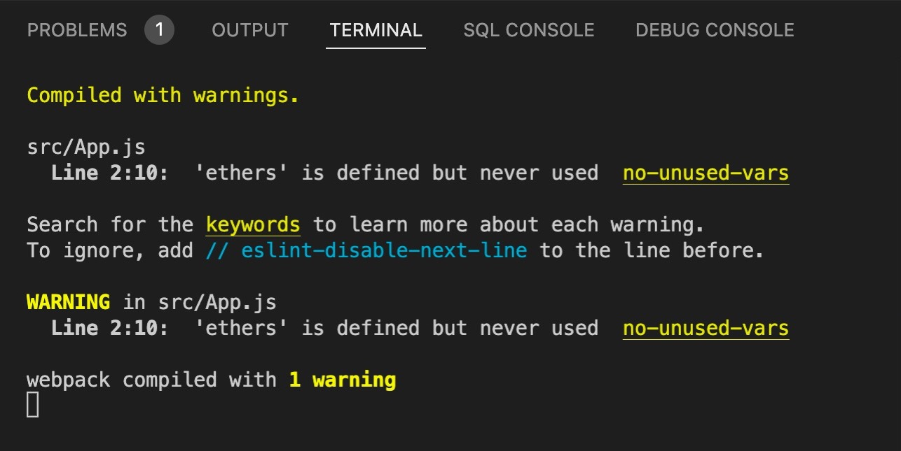
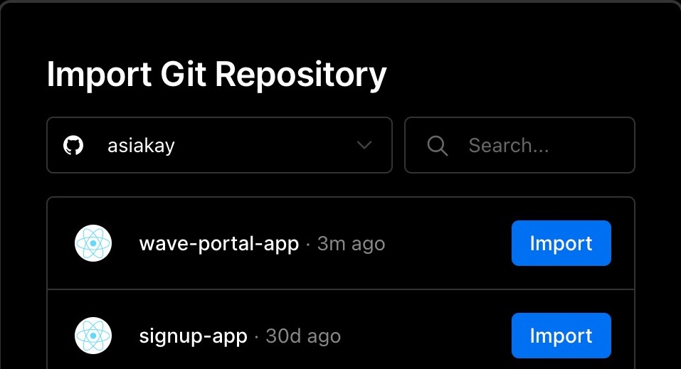
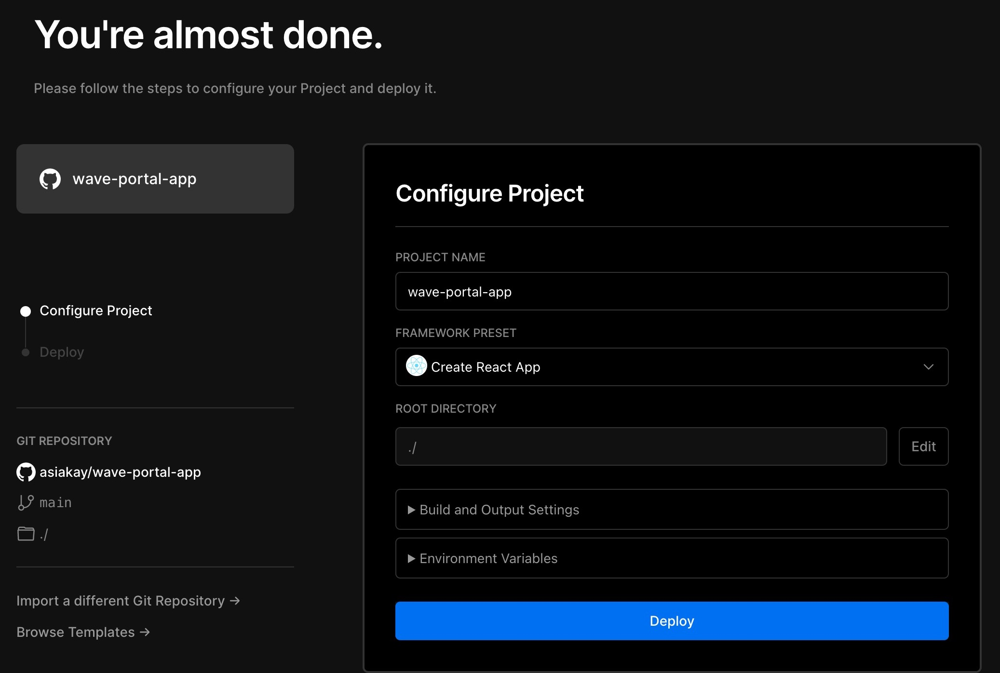
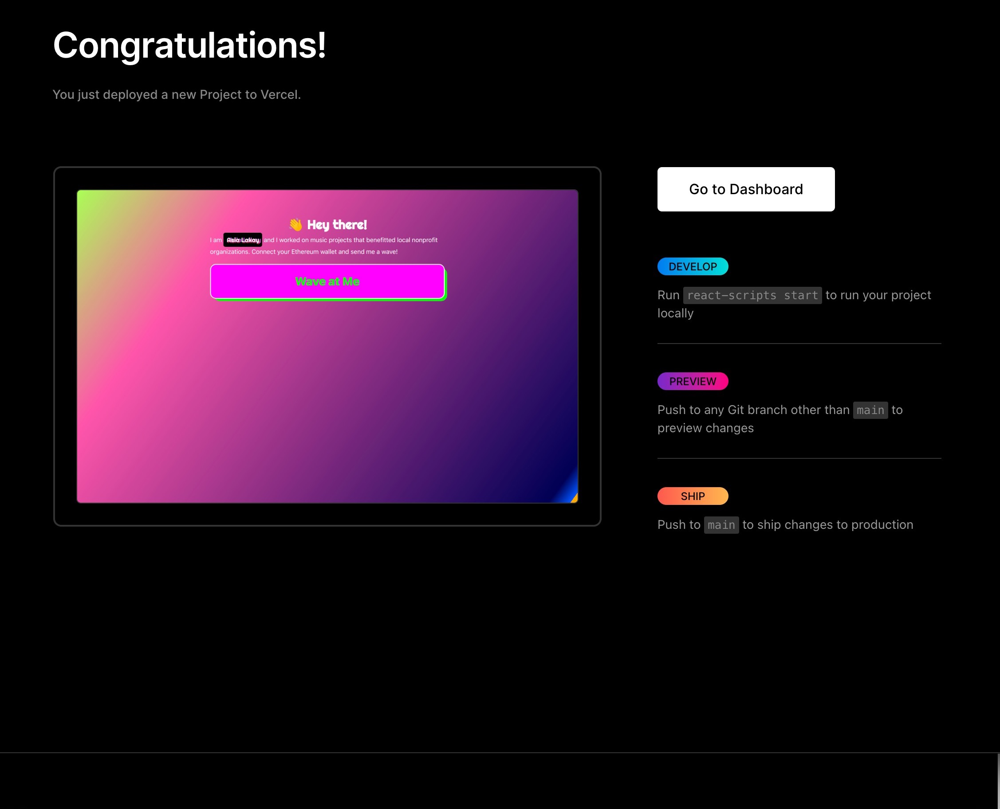

1. We're going to write a smart contract.

2. Our smart contract will be deployed to the blockchain

3. We're going to build a client website

<!--truncate-->

### ✨ The magic of Hardhat ### 
- lets us set up a local Ethereum Dev enviromnent
- provides test ETH for free dev testing 
- provides dummy accounts to work with 
- provides a vehicle for compiling smart contracts quickly for test deployment to a blockchain

The difference between blockchains and development servers are that blockchains are public record.  

Requirements to run Hardhat
- node/npm: checked to make sure node was installed by running the command `node -v` in VSCode's integrated CLI terminal. This command returned v16.15.0, the version that is currently installed. 

```Bash
(base) @mbp asialakay-docs %node -v
v16.15.0
```
If not installed or command not found, find [instructions for installing node.js here](https://hardhat.org/tutorial/setting-up-the-environment). Also, for newer releases of the node.js runtime, click [here](https://nodejs.org/en/about/releases/).

In the terminal, I started with the commands: 

```Bash
mkdir my-wave-portal
cd my-wave-portal
npm init -y
npm install --save-dev hardhat
```

With Hardhat having been installed, I added the folder `my-wave-portal` to the VSCode workspace. 

Then, I ran `npx hardhat` in the terminal. 

Which returned... 

 
```Bash
888    888                      888 888               888
888    888                      888 888               888
888    888                      888 888               888
8888888888  8888b.  888d888 .d88888 88888b.   8888b.  888888
888    888     "88b 888P"  d88" 888 888 "88b     "88b 888
888    888 .d888888 888    888  888 888  888 .d888888 888
888    888 888  888 888    Y88b 888 888  888 888  888 Y88b.
888    888 "Y888888 888     "Y88888 888  888 "Y888888  "Y888

👷 Welcome to Hardhat v2.9.7 👷‍

? What do you want to do? … 
❯ Create a basic sample project
  Create an advanced sample project
  Create an advanced sample project that uses TypeScript
  Create an empty hardhat.config.js
  Quit

```

I pressed enter, saying yes to everything - 
- creating a basic sample project
- choosing the project root 
- adding a .gitignore file
- installing with dependencies (@nomiclabs/hardhat-waffle ethereum-waffle chai @nomiclabs/hardhat-ethers ethers)

After dependencies were installed, the command line returned... 

```Bash
✨ Project created ✨
See the README.md file for some example tasks you can run.
```

... indicating successful installation.

Checking the `package.json` file that was installed with the commanf `npm init -y` shows that the required dependencies were installed.

```JSON
{
  "name": "my-wave-portal",
  "version": "1.0.0",
  "description": "",
  "main": "index.js",
  "scripts": {
    "test": "echo \"Error: no test specified\" && exit 1"
  },
  "keywords": [],
  "author": "",
  "license": "ISC",
  "devDependencies": {
    "@nomiclabs/hardhat-ethers": "^2.0.6",
    "@nomiclabs/hardhat-waffle": "^2.0.3",
    "chai": "^4.3.6",
    "ethereum-waffle": "^3.4.4",
    "ethers": "^5.6.8",
    "hardhat": "^2.9.7"
  }
}
```

Next, I ran `npx hardhat accounts` which returned the following Ethereum addresses: 

- 0xf39Fd6e51aad88F6F4ce6aB8827279cffFb92266
- 0x70997970C51812dc3A010C7d01b50e0d17dc79C8
- 0x3C44CdDdB6a900fa2b585dd299e03d12FA4293BC
- 0x90F79bf6EB2c4f870365E785982E1f101E93b906
- 0x15d34AAf54267DB7D7c367839AAf71A00a2C6A65
- 0x9965507D1a55bcC2695C58ba16FB37d819B0A4dc
- 0x976EA74026E726554dB657fA54763abd0C3a0aa9
- 0x14dC79964da2C08b23698B3D3cc7Ca32193d9955
- 0x23618e81E3f5cdF7f54C3d65f7FBc0aBf5B21E8f
- 0xa0Ee7A142d267C1f36714E4a8F75612F20a79720
- 0xBcd4042DE499D14e55001CcbB24a551F3b954096
- 0x71bE63f3384f5fb98995898A86B02Fb2426c5788
- 0xFABB0ac9d68B0B445fB7357272Ff202C5651694a
- 0x1CBd3b2770909D4e10f157cABC84C7264073C9Ec
- 0xdF3e18d64BC6A983f673Ab319CCaE4f1a57C7097
- 0xcd3B766CCDd6AE721141F452C550Ca635964ce71
- 0x2546BcD3c84621e976D8185a91A922aE77ECEc30
- 0xbDA5747bFD65F08deb54cb465eB87D40e51B197E
- 0xdD2FD4581271e230360230F9337D5c0430Bf44C0
- 0x8626f6940E2eb28930eFb4CeF49B2d1F2C9C1199

Next, I ran `npx hardhat compile`...

```Bash
(base) @mbp my-wave-portal %npx hardhat compile
Downloading compiler 0.8.4
Compiled 2 Solidity files successfully
```

...which verified that everything was working.

The following output was returned on running the command, `npx hardhat test`.

Our Smart Contract Test Result 


In VSCode, while keeping the folders intact, I deleted the files within named `test/sample-test.js`, `scripts/sample-scripts.js`, and `contracts/Greeter.sol`.

Our first error! 


Hovering over the squiggly red line gives the following clue as to what caused it. The clue reads, 
> "Source file requires different compiler version (current compiler is 0.7.3+commit.9bfce1f6.Emscripten.clang) - note that nightly builds are considered to be strictly less than the released version"

Changing the compiler version from 0.8.0 to 0.7.3 got rid of the compiler error. 

:::tip

The VS Code Solidity extension is useful for highlighting syntax. [Here's the link](https://marketplace.visualstudio.com/items?itemName=JuanBlanco.solidity).

:::

Because I changed the compiler version in `WavePortal.sol`, I had to change it in `hardhat.config.js`. They needed to be the same version. 

Debugged WavePortal.sol


hardhat.config.js


### Script to run the contract for interaction on the blockchain ##

The steps are 1) compile the contract, 2) deploy it to the blockchain, 3) and console.log to run it.

I wrote the script to iterate on the contract at `scripts/run.js`

(run.js)
```JavaScript
const main = async () => {
  const waveContractFactory = await hre.ethers.getContractFactory("WavePortal");
  const waveContract = await waveContractFactory.deploy();
  await waveContract.deployed();
  console.log("Contract deployed to:", waveContract.address);
};

const runMain = async () => {
  try {
    await main();
    process.exit(0); // exit Node process without error
  } catch (error) {
    console.log(error);
    process.exit(1); // exit Node process while indicating 'Uncaught Fatal Exception' error
  }
  // Read more about Node exit ('process.exit(num)') status codes here: https://stackoverflow.com/a/47163396/7974948
};

runMain();
```
Entering `npx hardhat run scripts/run.js`, returned: 

```bash
Downloading compiler 0.7.3
contracts/WavePortal.sol: Warning: SPDX license identifier not provided in source file. Before publishing, consider adding a comment containing "SPDX-License-Identifier: <SPDX-License>" to each source file. Use "SPDX-License-Identifier: UNLICENSED" for non-open-source code. Please see https://spdx.org for more information.

Compiled 2 Solidity files successfully
Greetings, I am a smart little contract.. ;)
Contract deployed to: 0x5FbDB2315678afecb367f032d93F642f64180aa3
```

adding `// SPDX-License-Identifier: UNLICENSED` to the top of `WaveContract.sol`


and then running `npx hardhat run scripts/run.js`

outputs... 

```Bash
Compiled 1 Solidity file successfully
Greetings, I am a smart little contract.. ;)
Contract deployed to: 0x5FbDB2315678afecb367f032d93F642f64180aa3
```
The contract is still deployed to the same address. 

:::info

[HRE stands for Hardhat Runtime Environment](https://hardhat.org/advanced/hardhat-runtime-environment). As an object, it contains all of the functionality that can be accessed when running a Hardhat task, test or script. Any commands ran starting with npx hardhat provides access to the hre object and properties. 

:::

### Storing Data on the Smart Contract ### 

The desired outcome is allowing the user to send a wave and then for that wave to be stored. 

in `WavePortal.sol`

the code has been updated as follows 

```JavaScript
// SPDX-License-Identifier: UNLICENSED

pragma solidity ^0.7.3;

import "hardhat/console.sol";

contract WavePortal {
    uint256 totalWaves;

    constructor(){
        console.log("Greetings, I am a smart little contract.. ;)");
    }

    function wave() public {
        totalWaves += 1;
        console.log("%s has waved!", msg.sender);
    }

    function getTotalWaves() public view returns (uint256){
        console.log("We have %d total waves!", totalWaves);
        return totalWaves;
    }
}

```

The new variable `totalWaves` is a state variable that is automatically initialized to 0 and permanently stored in the contract. 

`msg.sender` is the wallet address of whom called the function and serves as a built in authentication.

in `run.js`
We've updated the code as follows: 

```JavaScript
const main = async () => {
    const [owner, randomPerson] = await hre.ethers.getSigners();
    const waveContractFactory = await hre.ethers.getContractFactory("WavePortal"); // compiles the contract and generates files under the artifacts directory 
    const waveContract = await waveContractFactory.deploy(); // getting hardhat to create a "public" local Ethereum network for this contract that will self destruct after the script completes 
    await waveContract.deployed(); // waiting until the contrct is deployed to the local blockchain
    console.log("Contract deployed to:", waveContract.address); // once deployed, "waveContract.address" will give the address of the deployed contract
    console.log("Contract deployed by:", owner.address);

    let waveCount;
    waveCount = await waveContract.getTotalWaves();

    let waveTxn = await waveContract.wave();
    await waveTxn.wait();

    waveCount = await waveContract.getTotalWaves();
};

const runMain = async () => {
    try {
        await main();
        process.exit(0); // exit Node process without error
    } catch (error){
        console.log(error);
        process.exit(1); // exit Node process while indicating 'Uncaught Fatal Exception' error
    }
    // Read more about Node exit ('process.exit(num)') status codes here: https://stackoverflow.com/a/47163396/7974948
};

runMain();
```

We were able to get get the wallet address of the contract owner through the const `owner` along with a random wallet address as defined through the const `randomPerson` highlighted below.

`const [owner, randomPerson] = await hre.ethers.getSigners();`

adding... 

`console.log("Contract deployed by:", owner.address);`

...allows us to see the address of the person deploying the contract. 

```JavaScript
let waveCount;
waveCount = await waveContract.getTotalWaves();

let waveTxn = await waveContract.wave();
await waveTxn.wait();

waveCount = await waveContract.getTotalWaves();
```

The code directly above 1) calls the function to collect the total number of waves 2) waves, and 3) collects the updated number of waves after the newest wave has been completed.

running the code with the command 
`npx hardhat run scripts/run.js`

returns 

```Bash
Compiled 1 Solidity file successfully
Greetings, I am a smart little contract.. ;)
Contract deployed to: 0x5FbDB2315678afecb367f032d93F642f64180aa3
Contract deployed by: 0xf39Fd6e51aad88F6F4ce6aB8827279cffFb92266
We have 0 total waves!
0xf39fd6e51aad88f6f4ce6ab8827279cfffb92266 has waved!
We have 1 total waves!
```
Through the wallet addresses it is shown that the contract deployer is also the sender of the wave. 

Essentially, we did the following in deploying the contract: 

1. called the public wave function from WavePortal.sol
2. changed the value of the state variable `totalWaves`
3. read the new value of the `totalWaves` variable

In other words, we read a function, wrote a function, and changed the value of a state variable. 


#### Deploying Locally #### 

`npx hardhat node`

starts a local Ethereum network that does not self-destruct as the previous one does. 

Through Hardhat, the terminal output 20 accounts and Private keys funded with 10,000 (test)ETH each.

```Bash
Started HTTP and WebSocket JSON-RPC server at http://127.0.0.1:8545/

Accounts
========

WARNING: These accounts, and their private keys, are publicly known.
Any funds sent to them on Mainnet or any other live network WILL BE LOST.

Account #0: 0xf39Fd6e51aad88F6F4ce6aB8827279cffFb92266 (10000 ETH)
Private Key: 0xac0974bec39a17e36ba4a6b4d238ff944bacb478cbed5efcae784d7bf4f2ff80

Account #1: 0x70997970C51812dc3A010C7d01b50e0d17dc79C8 (10000 ETH)
Private Key: 0x59c6995e998f97a5a0044966f0945389dc9e86dae88c7a8412f4603b6b78690d

Account #2: 0x3C44CdDdB6a900fa2b585dd299e03d12FA4293BC (10000 ETH)
Private Key: 0x5de4111afa1a4b94908f83103eb1f1706367c2e68ca870fc3fb9a804cdab365a

Account #3: 0x90F79bf6EB2c4f870365E785982E1f101E93b906 (10000 ETH)
Private Key: 0x7c852118294e51e653712a81e05800f419141751be58f605c371e15141b007a6

Account #4: 0x15d34AAf54267DB7D7c367839AAf71A00a2C6A65 (10000 ETH)
Private Key: 0x47e179ec197488593b187f80a00eb0da91f1b9d0b13f8733639f19c30a34926a

Account #5: 0x9965507D1a55bcC2695C58ba16FB37d819B0A4dc (10000 ETH)
Private Key: 0x8b3a350cf5c34c9194ca85829a2df0ec3153be0318b5e2d3348e872092edffba

Account #6: 0x976EA74026E726554dB657fA54763abd0C3a0aa9 (10000 ETH)
Private Key: 0x92db14e403b83dfe3df233f83dfa3a0d7096f21ca9b0d6d6b8d88b2b4ec1564e

Account #7: 0x14dC79964da2C08b23698B3D3cc7Ca32193d9955 (10000 ETH)
Private Key: 0x4bbbf85ce3377467afe5d46f804f221813b2bb87f24d81f60f1fcdbf7cbf4356

Account #8: 0x23618e81E3f5cdF7f54C3d65f7FBc0aBf5B21E8f (10000 ETH)
Private Key: 0xdbda1821b80551c9d65939329250298aa3472ba22feea921c0cf5d620ea67b97

Account #9: 0xa0Ee7A142d267C1f36714E4a8F75612F20a79720 (10000 ETH)
Private Key: 0x2a871d0798f97d79848a013d4936a73bf4cc922c825d33c1cf7073dff6d409c6

Account #10: 0xBcd4042DE499D14e55001CcbB24a551F3b954096 (10000 ETH)
Private Key: 0xf214f2b2cd398c806f84e317254e0f0b801d0643303237d97a22a48e01628897

Account #11: 0x71bE63f3384f5fb98995898A86B02Fb2426c5788 (10000 ETH)
Private Key: 0x701b615bbdfb9de65240bc28bd21bbc0d996645a3dd57e7b12bc2bdf6f192c82

Account #12: 0xFABB0ac9d68B0B445fB7357272Ff202C5651694a (10000 ETH)
Private Key: 0xa267530f49f8280200edf313ee7af6b827f2a8bce2897751d06a843f644967b1

Account #13: 0x1CBd3b2770909D4e10f157cABC84C7264073C9Ec (10000 ETH)
Private Key: 0x47c99abed3324a2707c28affff1267e45918ec8c3f20b8aa892e8b065d2942dd

Account #14: 0xdF3e18d64BC6A983f673Ab319CCaE4f1a57C7097 (10000 ETH)
Private Key: 0xc526ee95bf44d8fc405a158bb884d9d1238d99f0612e9f33d006bb0789009aaa

Account #15: 0xcd3B766CCDd6AE721141F452C550Ca635964ce71 (10000 ETH)
Private Key: 0x8166f546bab6da521a8369cab06c5d2b9e46670292d85c875ee9ec20e84ffb61

Account #16: 0x2546BcD3c84621e976D8185a91A922aE77ECEc30 (10000 ETH)
Private Key: 0xea6c44ac03bff858b476bba40716402b03e41b8e97e276d1baec7c37d42484a0

Account #17: 0xbDA5747bFD65F08deb54cb465eB87D40e51B197E (10000 ETH)
Private Key: 0x689af8efa8c651a91ad287602527f3af2fe9f6501a7ac4b061667b5a93e037fd

Account #18: 0xdD2FD4581271e230360230F9337D5c0430Bf44C0 (10000 ETH)
Private Key: 0xde9be858da4a475276426320d5e9262ecfc3ba460bfac56360bfa6c4c28b4ee0

Account #19: 0x8626f6940E2eb28930eFb4CeF49B2d1F2C9C1199 (10000 ETH)
Private Key: 0xdf57089febbacf7ba0bc227dafbffa9fc08a93fdc68e1e42411a14efcf23656e

WARNING: These accounts, and their private keys, are publicly known.
Any funds sent to them on Mainnet or any other live network WILL BE LOST.
```

:::info
`npx hardhat node`: command to start a local Ethereum network that stays alive. 
:::


Next, I created a file called `deploy.js` under the scripts folder with the following code: 

```JavaScript
const main = async () => {
    const [deployer] = await hre.ethers.getSigners();
    const accountBalance = await deployer.getBalance();

    console.log("Deploying contracts with account: ", deployer.address);
    console.log("Account balance: ", accountBalance.toString());

    const waveContractFactory = await hre.ethers.getContractFactory("WavePortal");
    const waveContract = await waveContractFactory.deploy();
    await waveContract.deployed();

    console.log("WavePortal address: ", waveContract.address);
};

const runMain = async () => {
    try {
        await main();
        process.exit(0);
    } catch (error) {
        process.exit(1);
    }
};

runMain();
```

Next, I opened a new terminal window as to not kill the local Ethereum network created with the previously typed command `npx hardhat node`.

In the new window, I typed `npx hardhat run scripts/deploy.js --network localhost`. The code below was the output from the new terminal window.

```Bash
Deploying contracts with account:  0xf39Fd6e51aad88F6F4ce6aB8827279cffFb92266
Account balance:  10000000000000000000000
WavePortal address:  0x5FbDB2315678afecb367f032d93F642f64180aa3
```
This output shows that the contract has been deployed to its own address on the blockchain. 

In the terminal window that's running the local Ethereum network, I found the following new output: 

```Bash
 Contract deployment: WavePortal
  Contract address:    0x5fbdb2315678afecb367f032d93f642f64180aa3
  Transaction:         0xb28d6a696588528946849e73866e20e1eec458400a846f68d0b7d56c8027b6a4
  From:                0xf39fd6e51aad88f6f4ce6ab8827279cfffb92266
  Value:               0 ETH
  Gas used:            310042 of 310042
  Block #1:            0x685486b39e26adb335794060ea7994003d1be07a22ca6652f49f9da2d55e616f
  ```

### Setting up a react app with Metamask ### 

To complete the final stage of the project, I had to create a frontend with react. I `cd../` out of the terminal window for the `my-wave-portal` folder and started a new react application with the command `npx create-react-app wave-portal-app`. Then I entered `cd wave-portal-app` to enter the folder. 

The team at Buildspace provided a boilerplate to clone from github as well as one that can be forked on Replit. 

Since I'm working in VS code, I decided to build on the command line with the create-react-app code above. But I went to the github to review the import statements and structure of the application. 

Next, I added the folder for `wave-portal-app` to the workspace. 

Then, removed the files that were not needed, leaving the file structure to look like this... 




In `index.js`
- removed `import reportWebVitals from './reportWebVitals';` from the import statements at the top 
- removed the `reportWebVitals();` function at the bottom


In `App.js`... 
- removed `import logo from './logo.svg';`
- installed `npm install --save ethers` [source](https://www.npmjs.com/package/ethers)
- added `import { ethers } from "ethers";` to the import statements at the top of the file. 
- removed all the starter code that comes bootstrapped with create-react-app
- added the following code so the file appears like below: 
```JavaScript
import * as React from "react";
import { ethers } from "ethers";
import './App.css';

export default function App(){
  const wave = () => {

  }

  return (
    <div className="mainContainer">
      <div className="dataContainer">
      <div className="header">
      👋 Hey there!
      </div>

      <div className="bio">
        I am Asia Lakay and I worked on music projects that benefitted local nonprofit organizations. Connect your Ethereum wallet and send me a wave!
      </div>

      <button className="waveButton" onClick={wave}>
        Wave at Me
      </button>
    </div>
  </div>
  );
}
```

Find the css files here at the repo.
[buildspace / waveportal-starter-project code](https://github.com/buildspace/waveportal-starter-project?utm_source=buildspace.so&utm_medium=buildspace_project)

after running `npm start` in the terminal, I was presented with the message below. 



We'll get to the warnings in a moment. But here is the basic user interface that I started with along with some slight changes with sass for personalization.


One thing that stands out about the buildspace hackathon is that there are checkpoints along the way to share your progress with the community. The current checkpoint asks to share a link to your UI.  

To do that, I'll be pushing it to Github and deploying on Vercel. 

- `git init` to initialize an empty Git repository at the project's folder. 
- `git add .` to stage the files 
- `git commit -m "first commit" 
- using the Github CLI `gh auth login` and selecting GitHub.com
- selecting `HTTPS` as the preferred protocol for Git operations
- selecting `Y` to authenticate Git with my GitHub credentials
- pasting an authentication token generated at https://github.com/settings/tokens / configuring git protocol / verifying login
- entered `gh repo create wave-portal-app --public` in the terminal
- declined adding a `.gitignore` file because one already exists in the local repository folder 
- declined adding a license
- confirmed adding an "origin' git remote to the local repository
- entered `git branch -M main` in the terminal
- entered `git push -u origin main` in the terminal


:::tip
A new release of gh is available: 2.0.0 → v2.11.3
To upgrade, run: brew update && brew upgrade gh
https://github.com/cli/cli/releases/tag/v2.11.3
::: 

Once the files were pushed to GitHub, I headed over to vercel.com/dashboard to add the new project. 







That's all for Part 1, we've got 50% of the project completed. In the next part, 1) we will connect to a wallet, 2) interact with the contract and 3) beautify the UI for deployment. If you want to join the Buildspace community and follow at your own pace, signup at [Buildspace.so](https://www.buildspace.so).

REFERENCES
[Build a Web3 app with Solidity](https://buildspace.so/p/build-solidity-web3-app)
[source code on github](https://github.com/asiakay/my-wave-portal)
[Buildspace reference code on github](https://gist.github.com/adilanchian/9f745fdfa9186047e7a779c02f4bffb7?utm_source=buildspace.so&utm_medium=buildspace_project)
