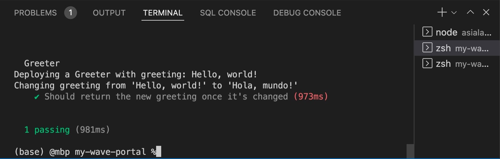
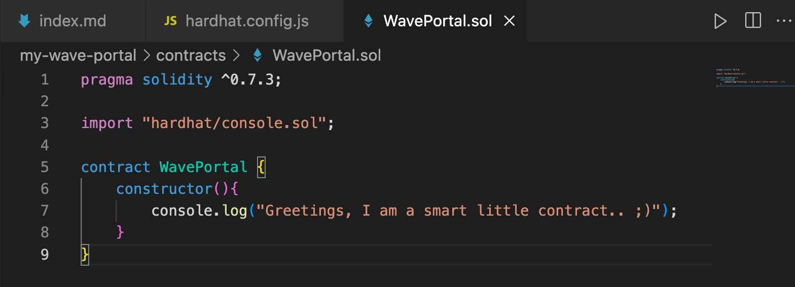
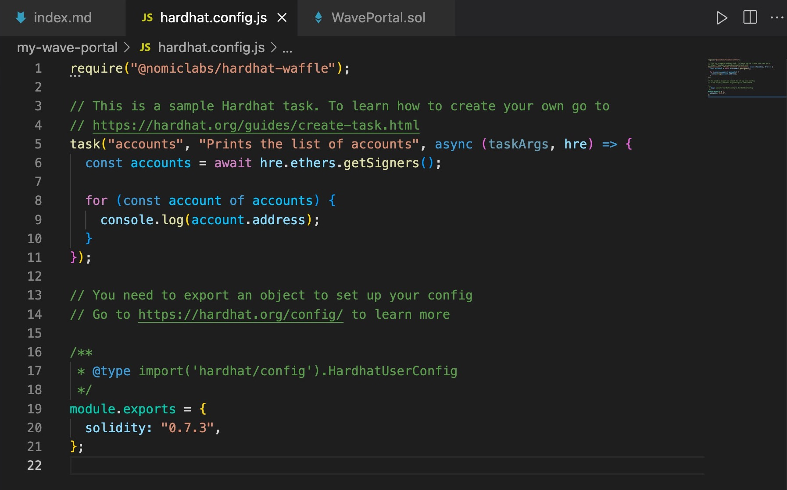

1. We're going to write a smart contract.

2. Our smart contract will be deployed to the blockchain

3. We're going to build a client website

<!--truncate-->

### ✨ The magic of Hardhat ### 
- lets us set up a local Ethereum Dev enviromnent
- provides test ETH for free dev testing 
- provides dummy accounts to work with 
- provides a vehicle for compiling smart contracts quickly for test deployment to a blockchain

The difference between blockchains and development servers are that blockchains are public record.  

Requirements to run Hardhat
- node/npm: checked to make sure node was installed by running the command `node -v` in VSCode's integrated CLI terminal. This command returned v16.15.0, the version that is currently installed. 

```Bash
(base) @mbp asialakay-docs %node -v
v16.15.0
```
If not installed or command not found, find [instructions for installing node.js here](https://hardhat.org/tutorial/setting-up-the-environment). Also, for newer releases of the node.js runtime, click [here](https://nodejs.org/en/about/releases/).

In the terminal, I started with the commands: 

```Bash
mkdir my-wave-portal
cd my-wave-portal
npm init -y
npm install --save-dev hardhat
```

With Hardhat having been installed, I added the folder `my-wave-portal` to the VSCode workspace. 

Then, I ran `npx hardhat` in the terminal. 

Which returned... 

 
```Bash
888    888                      888 888               888
888    888                      888 888               888
888    888                      888 888               888
8888888888  8888b.  888d888 .d88888 88888b.   8888b.  888888
888    888     "88b 888P"  d88" 888 888 "88b     "88b 888
888    888 .d888888 888    888  888 888  888 .d888888 888
888    888 888  888 888    Y88b 888 888  888 888  888 Y88b.
888    888 "Y888888 888     "Y88888 888  888 "Y888888  "Y888

👷 Welcome to Hardhat v2.9.7 👷‍

? What do you want to do? … 
❯ Create a basic sample project
  Create an advanced sample project
  Create an advanced sample project that uses TypeScript
  Create an empty hardhat.config.js
  Quit

```

I pressed enter, saying yes to everything - 
- creating a basic sample project
- choosing the project root 
- adding a .gitignore file
- installing with dependencies (@nomiclabs/hardhat-waffle ethereum-waffle chai @nomiclabs/hardhat-ethers ethers)

After dependencies were installed, the command line returned... 

```Bash
✨ Project created ✨
See the README.md file for some example tasks you can run.
```

... indicating successful installation.

Checking the `package.json` file that was installed with the commanf `npm init -y` shows that the required dependencies were installed.

```JSON
{
  "name": "my-wave-portal",
  "version": "1.0.0",
  "description": "",
  "main": "index.js",
  "scripts": {
    "test": "echo \"Error: no test specified\" && exit 1"
  },
  "keywords": [],
  "author": "",
  "license": "ISC",
  "devDependencies": {
    "@nomiclabs/hardhat-ethers": "^2.0.6",
    "@nomiclabs/hardhat-waffle": "^2.0.3",
    "chai": "^4.3.6",
    "ethereum-waffle": "^3.4.4",
    "ethers": "^5.6.8",
    "hardhat": "^2.9.7"
  }
}
```

Next, I ran `npx hardhat accounts` which returned the following Ethereum addresses: 

- 0xf39Fd6e51aad88F6F4ce6aB8827279cffFb92266
- 0x70997970C51812dc3A010C7d01b50e0d17dc79C8
- 0x3C44CdDdB6a900fa2b585dd299e03d12FA4293BC
- 0x90F79bf6EB2c4f870365E785982E1f101E93b906
- 0x15d34AAf54267DB7D7c367839AAf71A00a2C6A65
- 0x9965507D1a55bcC2695C58ba16FB37d819B0A4dc
- 0x976EA74026E726554dB657fA54763abd0C3a0aa9
- 0x14dC79964da2C08b23698B3D3cc7Ca32193d9955
- 0x23618e81E3f5cdF7f54C3d65f7FBc0aBf5B21E8f
- 0xa0Ee7A142d267C1f36714E4a8F75612F20a79720
- 0xBcd4042DE499D14e55001CcbB24a551F3b954096
- 0x71bE63f3384f5fb98995898A86B02Fb2426c5788
- 0xFABB0ac9d68B0B445fB7357272Ff202C5651694a
- 0x1CBd3b2770909D4e10f157cABC84C7264073C9Ec
- 0xdF3e18d64BC6A983f673Ab319CCaE4f1a57C7097
- 0xcd3B766CCDd6AE721141F452C550Ca635964ce71
- 0x2546BcD3c84621e976D8185a91A922aE77ECEc30
- 0xbDA5747bFD65F08deb54cb465eB87D40e51B197E
- 0xdD2FD4581271e230360230F9337D5c0430Bf44C0
- 0x8626f6940E2eb28930eFb4CeF49B2d1F2C9C1199

Next, I ran `npx hardhat compile`...

```Bash
(base) @mbp my-wave-portal %npx hardhat compile
Downloading compiler 0.8.4
Compiled 2 Solidity files successfully
```

...which verified that everything was working.

The following output was returned on running the command, `npx hardhat test`.

Our Smart Contract Test Result 




In VSCode, while keeping the folders intact, I deleted the files within named `test/sample-test.js`, `scripts/sample-scripts.js`, and `contracts/Greeter.sol`.

Our first error! 


Hovering over the squiggly red line gives the following clue as to what caused it. The clue reads, 
> "Source file requires different compiler version (current compiler is 0.7.3+commit.9bfce1f6.Emscripten.clang) - note that nightly builds are considered to be strictly less than the released version"

Changing the compiler version from 0.8.0 to 0.7.3 got rid of the compiler error. 

:::tip

The VS Code Solidity extension is useful for highlighting syntax. [Here's the link](https://marketplace.visualstudio.com/items?itemName=JuanBlanco.solidity).

:::

Because I changed the compiler version in `WavePortal.sol`, I had to change it in `hardhat.config.js`. They needed to be the same version. 

Debugged WavePortal.sol


hardhat.config.js


### Script to run the contract for interaction on the blockchain ##

The steps are 1) compile the contract, 2) deploy it to the blockchain, 3) and console.log to run it.

I wrote the script to iterate on the contract at `scripts/run.js`

(run.js)
```JavaScript
const main = async () => {
  const waveContractFactory = await hre.ethers.getContractFactory("WavePortal");
  const waveContract = await waveContractFactory.deploy();
  await waveContract.deployed();
  console.log("Contract deployed to:", waveContract.address);
};

const runMain = async () => {
  try {
    await main();
    process.exit(0); // exit Node process without error
  } catch (error) {
    console.log(error);
    process.exit(1); // exit Node process while indicating 'Uncaught Fatal Exception' error
  }
  // Read more about Node exit ('process.exit(num)') status codes here: https://stackoverflow.com/a/47163396/7974948
};

runMain();
```
Entering `npx hardhat run scripts/run.js`, returned: 

```bash
Downloading compiler 0.7.3
contracts/WavePortal.sol: Warning: SPDX license identifier not provided in source file. Before publishing, consider adding a comment containing "SPDX-License-Identifier: <SPDX-License>" to each source file. Use "SPDX-License-Identifier: UNLICENSED" for non-open-source code. Please see https://spdx.org for more information.

Compiled 2 Solidity files successfully
Greetings, I am a smart little contract.. ;)
Contract deployed to: 0x5FbDB2315678afecb367f032d93F642f64180aa3
```

adding `// SPDX-License-Identifier: UNLICENSED` to the top of `WaveContract.sol`


and then running `npx hardhat run scripts/run.js`

outputs... 

```Bash
Compiled 1 Solidity file successfully
Greetings, I am a smart little contract.. ;)
Contract deployed to: 0x5FbDB2315678afecb367f032d93F642f64180aa3
```
The contract is still deployed to the same address. 

:::info

[HRE stands for Hardhat Runtime Environment](https://hardhat.org/advanced/hardhat-runtime-environment). As an object, it contains all of the functionality that can be accessed when running a Hardhat task, test or script. ANy commands ran starting with npx hardhat provides access to the hre object and properties. 

:::

That's all for today, but in the next part we will store data on our smart contract. If you want to join the Buildspace community and follow at your own pace, signup at [Buildspace.so](https://www.buildspace.so).