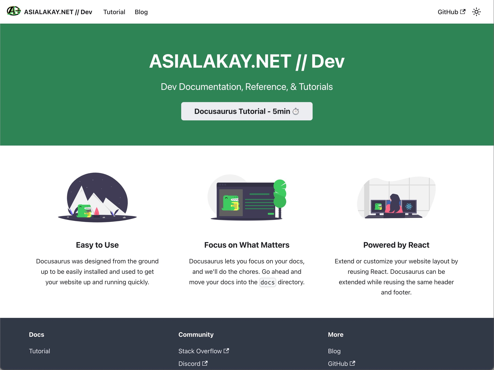

With the exception of the logo, blog title, and tagline, here is what the landing page looked like out the box. 



For the purpose of this integration, the preferred option was to allowing users to land directly on the blog. 


Steps:

Created a new branch for development. TO do this, I typed the following command into the terminal:

`git checkout -b land-on-blog`

This returned: 

`Switched to a new branch 'land-on-blog'`

According to the Docusaurus documentation: 

> You can run your Docusaurus 2 site without a dedicated landing page and instead have your blog's post list page as the index page. Set the routeBasePath to be '/' to serve the blog through the root route example.com/ instead of the subroute example.com/blog/.

Here is the [example code](https://docusaurus.io/docs/blog#blog-only-mode) they provide including a reminder to delete the existing homepage at `./src/pages/index.js`


Here is the `docusaurus.config.js` file that exists in our codebase before making the changes described in the Docusaurus documentation. 


To make the required changes:  

1. The value, `false` was assigned to the key `docs`.

2. The key/value pairs for: `sidebarPath`, and `editUrl` were removed.

3. The key `routeBasePath` with the value `'/'` was added to serve the blog at the site root. 

4. The file at `.src/pages/index.js` was removed to resolve conflicts based on two pages (the old docs index, and the new blog index) being served from the same route.
> 
```JSON
        {
          sidebarPath: require.resolve('./sidebars.js'),
          // Please change this to your repo.
          // Remove this to remove the "edit this page" links.
          editUrl:
            'https://github.com/asiakay/asialakay-docs',
        },
```
(removed code from `docusaurus.config.js`)

Saving the `docusaurus.config.js` file returned the following warning in the terminal:

> ```Bash
[WARNING] Duplicate routes found!
- Attempting to create page at /, but a page already exists at this route.
This could lead to non-deterministic routing behavior.
```

These changes, although followed to the letter, still caused a bug: 


Deleting the `src/pages/index.js`, returned the following response in the terminal 

```Bash
Module not found: Error: Can't resolve '@site/src/pages/index.js' in '/Users/asialakaygradyloves/apps/asialakay-docs/.docusaurus'
Module not found: Error: Can't resolve '@site/src/pages/index.js' in '/Users/asialakaygradyloves/apps/asialakay-docs/.docusaurus'
```

Further inspection through the developer tools tab in the browser menu, reveals the below message in the Console. 


Steps attempted to solve the problem: 
- added the key `path` with the value `blog` (did not resolve bug)

- Attempted `npm uninstall  @docusaurus/plugin-content-docs` (did not resolve the bug).

- Searched documentation for "plugin global data" found that their appears to be a bug that is documented on Github for this issue

- Reviewed code in `docusaurus.config.js` item object key/value pairs referencing `doc`, `docId`, `position`, and `tutorial`. 


The last step resolved the bug and allowed the page to load from the root.

