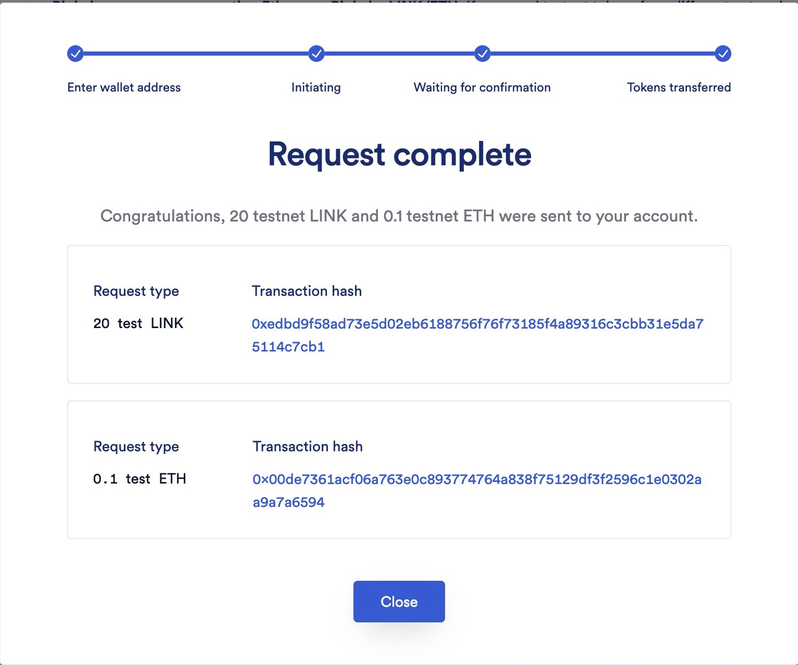
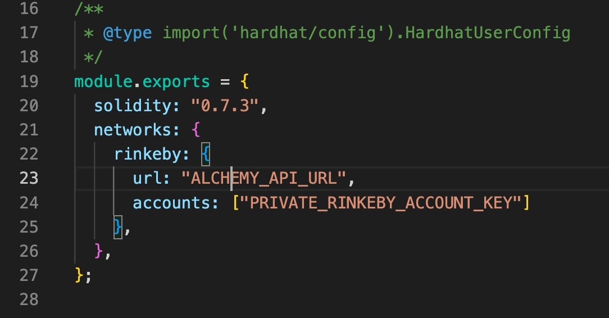
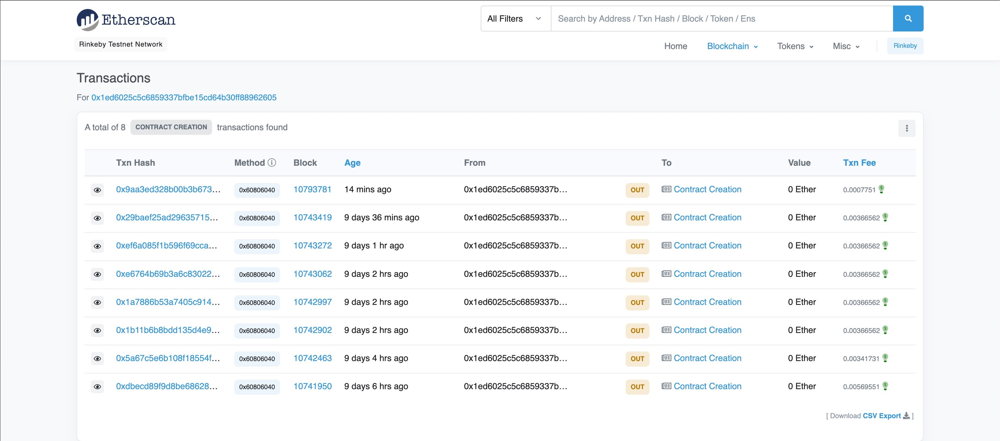
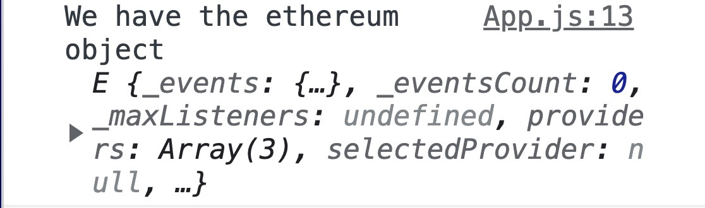
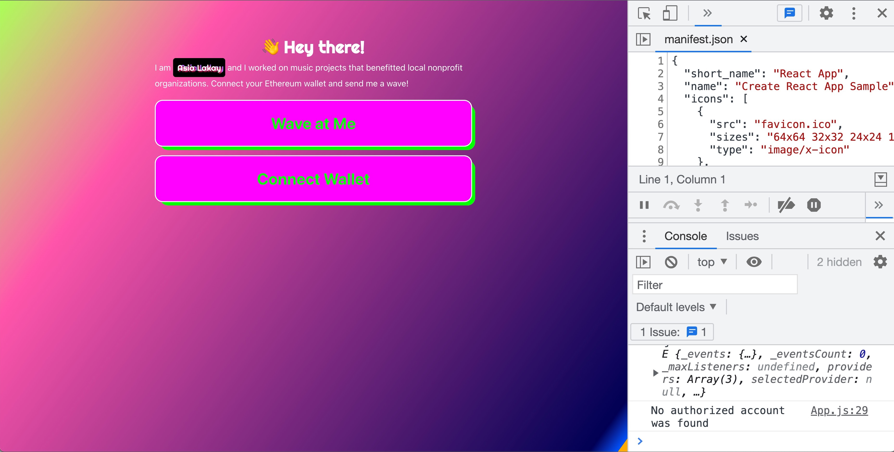
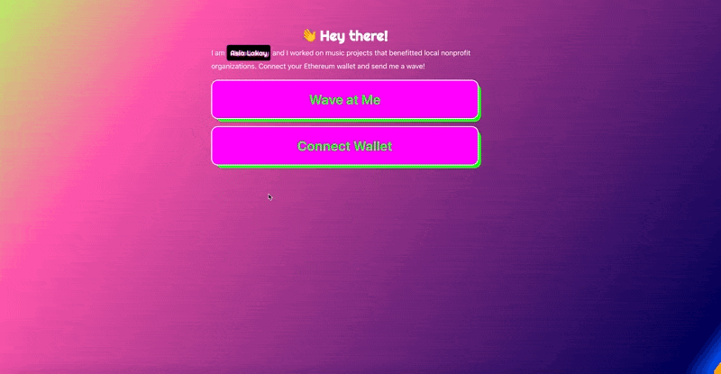
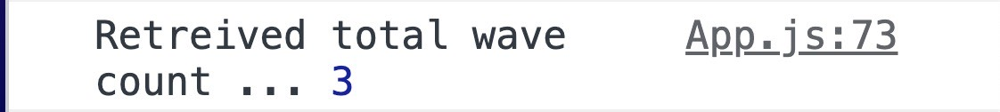
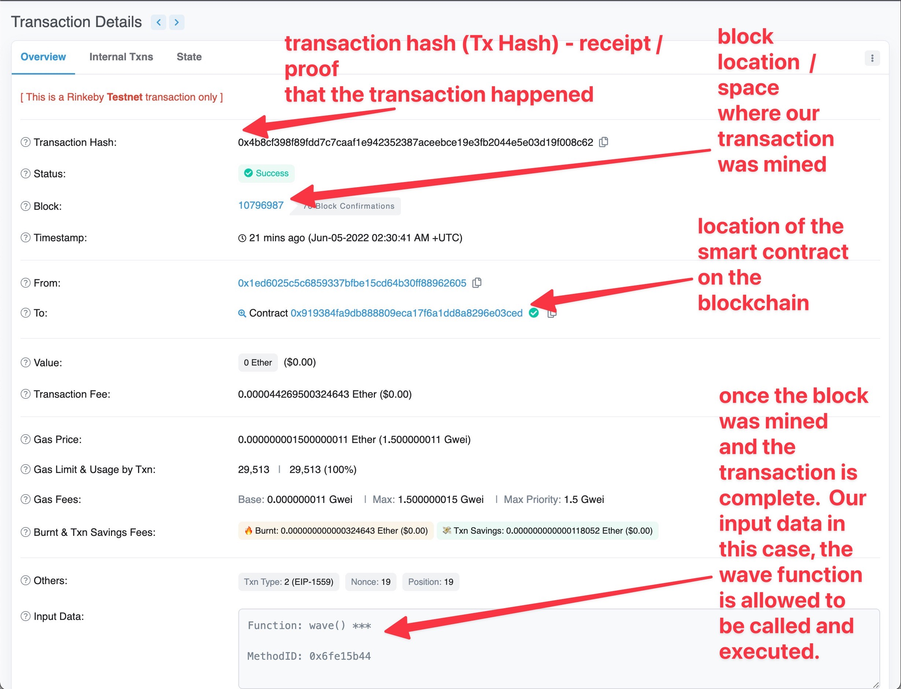
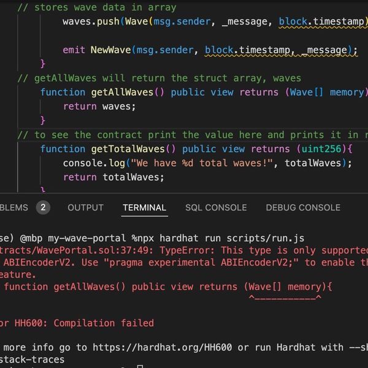
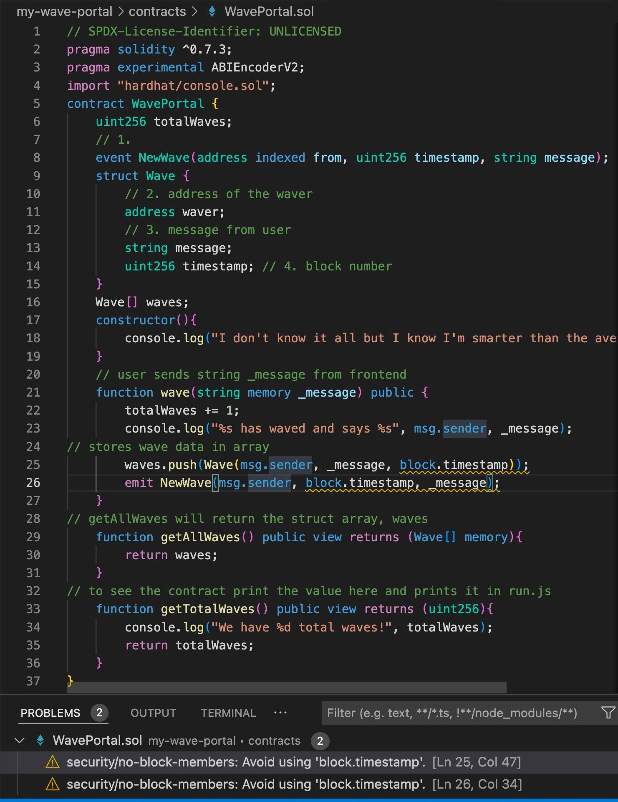

In Part 1, 
- We set up a local Ethereum network
- Wrote a smart contract in Solidity
- Compiled the contract and ran it locally
- Stored data on the smart contract 
- deployed the smart contract locally and started building the User Interface
- deployed the UI to Vercel

In this part, we will be 
- setting up Metamask
- deploying the smart contract to a testnet
- connecting a wallet to the web app
calling the deployed smart contract from the web app 

<!--truncate-->

Closed the terminal running the local blockchain network


[Making an account with Alchemy](https://alchemy.com/?r=b93d1f12b8828a57?utm_source=buildspace.so&utm_medium=buildspace_project) is a way to simplify deployment to the Ethereum blockchain among others including Polygon and Solana. There's no CEO of the blockchain. It's able to be decentralized because it is peer-to-peer. Computers keep a public record of all transactions. Alchemy is used to share transactions quickly. 

For reference on how to get an API key to use on a testnet, check out this video from Buildspace.

 [source](https://www.loom.com/share/21aa1d64ea634c0c9da8fc5faaf24283)

:::info
Testnets are web3 developers friends. They allow you to test applications without having to spend money on gas fees. Since the filming of this video, there have been changes. Rinkeby network will be depreciated in the near future, affecting the functionality of the service.
:::

I got my test ETH from Chainlink's faucet located, [here](https://faucets.chain.link/rinkeby). Connecting a wallet through Metamask or Coinbase wallet is a requirement. 



### Deploying to Rinkeby Testnet ### 

Added `rinkeby`, `url`, and `accounts` key/value pairs   to networks object in the `hardhat.config.js` file 




:::warning
Never expose your private keys. When committing to GitHub, add hardhat.config.js to the .gitignore file and/or use environmental variables with the dotenv npm package.
:::

To add a layer of security to the application, I 
- installed dotenv with the command `npm install --save dotenv`.

- added `require("dotenv").config();` to the top of `hardhat.config.js`.

- created a file `.env` in the project's root directory to hide the sensitive information

- updated hardhat.config.js file with the dotenv environmental variable values from Alchemy and Metamask 

To deploy the contract with updated keys and networks 

I ran `npx hardhat run scripts/deploy.js --network rinkeby` in the terminal.

This returned..

```Bash
(base) @mbp my-wave-portal %npx hardhat run scripts/dep
loy.js --network rinkeby
Deploying contracts with account:  0x1eD6025c5c6859337bFbe15Cd64b30FF88962605
Account balance:  171623712904293081
WavePortal address:  0x919384Fa9DB888809eca17F6A1DD8a8296e03CeD
```

Looking good. Contract deployed! [Click here](https://rinkeby.etherscan.io/address/0x919384Fa9DB888809eca17F6A1DD8a8296e03CeD) to see it on Etherscan.

TBH. I would be more excited if this was my first smart contract, but it's my 8TH! 



 Plowing along and looking forward to making the connection with an interactive frontend for this Buildspace hackathon project! 


### Connecting the Wallet to the Web App ### 

#### Using window.ethereum() #### 

[x] Connected the wallet to our website

```JavaScript
import React, { useEffect } from "react";
import "./style.scss";

const App = () => {

  const checkIfWalletIsConnected = () => {
// 1. Check if we have access to window.ethereum
    const { ethereum } = window;

    if (!ethereum){
    console.log("Make sure you have metamask installed.");
    } else {
      console.log("We have access to the ethereum object", ethereum);
    }
  }

// 2. run the checkIfWalletIsConnected() function when page loads 
useEffect(() => {
  checkIfWalletIsConnected();
}, [])

return (
  <div className="mainContainer">
    <div className="dataContainer">
      <div className="header">
        <h1>👋 Hey there!</h1>
      </div> {/* .header */}

        <div className="bio">
        <h2>I am <span className="name">Asia Lakay.</span></h2>
        My passion is music because of its power to help people change their attitude, mood, and perspective.
        My other passion is tech because of its potential to help people improve express themselves and improve their quality of life.
        </div>{/* .bio */}

        <button 
        className="waveButton" 
        onClick={null}>
          Click Here to Send a Wave
        </button>
    </div> {/* /* .dataContainer * */}
  </div> /* .mainContainer */
  );
}
```
After running the app with `npm start`, I checked the developer tools console and found...



Being that I've logged into Metamask, I was able to access an object called `ethereum` that was automatically injected into the window. 

#### Checking if we're "logged in" ####

[x] Authorized to access the user's wallet 

```JavaScript
import React, { useEffect, useState } from "react";
import "./App.css";

const App = () => {
  /*
  * Just a state variable we use to store our user's public wallet.
  */
  const [currentAccount, setCurrentAccount] = useState("");

  const checkIfWalletIsConnected = async () => {
    try {
      const { ethereum } = window;

      if (!ethereum) {
        console.log("Make sure you have metamask!");
        return;
      } else {
        console.log("We have the ethereum object", ethereum);
      }

      /*
      * Check if we're authorized to access the user's wallet
      */
      const accounts = await ethereum.request({ method: "eth_accounts" });

      if (accounts.length !== 0) {
        const account = accounts[0];
        console.log("Found an authorized account:", account);
        setCurrentAccount(account)
      } else {
        console.log("No authorized account found")
      }
    } catch (error) {
      console.log(error);
    }
  }

  useEffect(() => {
    checkIfWalletIsConnected();
  }, [])

return (
  <div className="mainContainer">
    <div className="dataContainer">
      <div className="header">
        <h1>👋 Hey there!</h1>
      </div> {/* .header */}

        <div className="bio">
        <h2>I am <span className="name">Asia Lakay.</span></h2>
        My passion is music because of its power to help people create connections and boost their moods.
        My other passion is tech because of its potential to help people improve express themselves and improve their quality of life.
        </div>{/* .bio */}

        <button 
        className="waveButton" 
        onClick={null}>
          Click Here to Send a Wave
        </button>
    </div> {/* /* .dataContainer * */}
  </div> /* .mainContainer */
  );
}

export default App
```
:::info
- `eth_accounts`: to see if we're authorized to access any of the accounts in the user's wallet
:::

#### 💰 Build a connect wallet button ####

So far, the application is behaving as expected. Whoo hoo! 

After checking to see if the user was logged in, the console output "No authorized account was found". This is because there we have yet to provide a feature that gives the user an option to allow the site wallet to have access to their wallet.  

To solve this problem, a connect wallet button is needed. 

Here is how our UI looks after programming the logic. 



#### 🌐 Connect! #### 

```JavaScript
import React, { useEffect, useState } from "react";
import "./App.css";

const App = () => {
  /*
  * Just a state variable we use to store our user's public wallet.
  */
  const [currentAccount, setCurrentAccount] = useState("");

  const checkIfWalletIsConnected = async () => {
    try {
      const { ethereum } = window;

      if (!ethereum) {
        console.log("Make sure you have metamask!");
        return;
      } else {
        console.log("We have the ethereum object", ethereum);
      }

      /*
      * Check if we're authorized to access the user's wallet
      */
      const accounts = await ethereum.request({ method: "eth_accounts" });

      if (accounts.length !== 0) {
        const account = accounts[0];
        console.log("Found an authorized account:", account);
        setCurrentAccount(account)
      } else {
        console.log("No authorized account found")
      }
    } catch (error) {
      console.log(error);
    }
  }

  /**
  * Implement your connectWallet method here
  */
  const connectWallet = async () => {
    try {
      const { ethereum } = window; 

      if (!ethereum){
        alert("Please Get MetaMask");
        return;
      }

      const accounts = await ethereum.request({ method: "eth_requestAccounts"});

      console.log("Connected", accounts[0]);
      setCurrentAccount(accounts[0]);
    } catch (error){
      console.log(error)
    }
  }


  useEffect(() => {
    checkIfWalletIsConnected();
  }, [])

return (
  <div className="mainContainer">
    <div className="dataContainer">
      <div className="header">
        <h1>👋 Hey there!</h1>
      </div> {/* .header */}

        <div className="bio">
        <h2>I am <span className="name">Asia Lakay.</span></h2>
        My passion is music because of its power to help people create connections and boost their moods.
        My other passion is tech because of its potential to help people improve express themselves and improve their quality of life.
        </div>{/* .bio */}

        <button 
        className="waveButton" 
        onClick={null}>
          Click Here to Send a Wave
        </button>

        {/* If there is no currentAccount, then render the {connectWallet} button below */}
        {!currentAccount && (
          <button className="waveButton" onClick={connectWallet}>
            Connect Wallet
          </button>
        )}

    </div> {/* /* .dataContainer * */}
  </div> /* .mainContainer */
  );
}

export default App
```


:::info
- `connectWallet`: only shown if there is no `currentAccount` detected
- `useState`: 
- `eth_requestAccounts`: "asking Metamask to give me access to the user's wallet"
::: 

Here's a demo in action. 




### Call the deployed smart contract from the web app ### 


#### 📒 Read from the blockchain through our website ####

Function to retrieve total number of waves from `WaveContract.sol` 
```JavaScript
function getTotalWaves() public view returns (uint256) {
      console.log("We have %d total waves!", totalWaves);
      return totalWaves;
  }
```

TESTING CONTRACT METHODS 

---

```JavaScript
    let waveCount; 
    waveCount = await waveContract.getTotalWaves();
```
:

```Bash
I don't know much but I know I am a smart contract
Contract deployed to address: 0x5FbDB2315678afecb367f032d93F642f64180aa3
We have 0 total waves!
```

Outputs 
- console.log() statement from WavePortal contract constructor in `run.js` file. 

---


in `App.js`
```JavaScript
const provider = new ethers.providers.Web3Provider(ethereum);
const signer = provider.getSigner();
```
(insert link to github)

:::info
"ethers is a library that helps our frontend talk to our contract. Be sure to import it at the top using `import { ethers } from "ethers"`;

`signer`: [more info](https://docs.ethers.io/v5/api/signer/#signers?utm_source=buildspace.so&utm_medium=buildspace_project)

"Connect the `wave` `async` function to our wave button by updating the onClick prop from `{null}` to `{wave}`"

`artifacts`: is a folder that autogenerates ABI files


::: 


#### 🏠 Setting Your Contract Address #### 

```Bash
Compiled 1 Solidity file successfully
Deploying contracts with account:  0x1eD6025c5c6859337bFbe15Cd64b30FF88962605
Account balance:  167738780385731813
// highlight-next-line
WavePortal address:  0x20A3fAa4B6A1C1C44D9A111697BBDA2647E269a1
```

:::tip
use WavePortal address value to define `contractAddress` var in `App.js` file 
`const contractAddress = "0x20A3fAa4B6A1C1C44D9A111697BBDA2647E269a1";`
:::


#### 🛠 Getting ABI File Content #### 


copy the contents of `artifacts/contracts/WavePortal.sol/WavePortal.json` to frontend project folder `src/utils/WavePortal.json`

add import statement `import abi from "./utils/WavePortal.json";` to `App.js` file

reference imported ABI in a var: `const contractABI = abi.abi;`


The next step is to call the function that gets the total number of waves that was written in the smart contract. At this stage it will be called from the user interface. 

Added `import { ethers } from "ethers";` to `App.js`

Connected wave function to wave button 

Plugged WavePortal address from initial deployment into contractAddress

Copied ABI file contents from `artifacts/contracts/WavePortal.sol/WavePortal.json` in the Solidity project to `src/utils/WavePortal.json` in the frontend application. 

As is, the application allows users to:

1. click the "Wave at Me" button to retreive and read data from the blockchain (total number of waves is output to be read from the console) 


2. write data to the blockchain through the mining process where the user may "contract" the miners (decentralized nodes) in competition (in the proof of work consensus mechanism) to add their data to the next available block.


3. verify the completion and finality of the transaction through the tx hash on the blockchain explorer.




[source: Etherscan](https://rinkeby.etherscan.io/tx/0x4b8cf398f89fdd7c7caaf1e942352387aceebce19e3fb2044e5e03d19f008c62)

The hackathon encouraged me to challenge myself and come up with features that will make my application unique. 

I would like to add features that 
- allow the user to view the total number of waves within the UI. 
- allow the user to add to the total number of waves and see change in updated total number of waves from the UI. 
- posts a random song lyric to the console


First, I viewed the app on mobile 


created a div with classname "allWaves"


Vocabulary: 
ABI - application binary interface 

Questions: 
Do I have a getWaves function>

What are view functions?
https://stackoverflow.com/questions/71946498/how-to-get-the-returned-data-from-a-smart-contract-function-using-ethers-js


Create a new GitHub Repository from the command line
https://www.techielass.com/create-a-new-github-repository-from-the-command-line/

CSS 
https://cssgradient.io/


How to Add and Use Google and Custom Fonts in React App
https://www.positronx.io/react-js-include-custom-fonts-google-fonts-tutorial/

Block timestamp manipulation attack
https://cryptomarketpool.com/block-timestamp-manipulation-attack/



[Solidity — Enable ABIEncoderV2 to use Structs as Function parameters](https://medium.com/@dillonsvincent/solidity-enable-experimental-abiencoderv2-to-use-a-struct-as-function-parameter-27979603a879)

```Json
(base) @mbp my-wave-portal %npx hardhat run scripts/run.js
Compiled 1 Solidity file successfully
I don't know it all but I know I'm smarter than the average contract.
Contract deployed to: 0x5FbDB2315678afecb367f032d93F642f64180aa3
We have 0 total waves!
0
0xf39fd6e51aad88f6f4ce6ab8827279cfffb92266 has waved and says A message.
0x70997970c51812dc3a010c7d01b50e0d17dc79c8 has waved and says Another message!
[
  [
    '0xf39Fd6e51aad88F6F4ce6aB8827279cffFb92266',
    'A message.',
    BigNumber { value: "1654410329" },
    waver: '0xf39Fd6e51aad88F6F4ce6aB8827279cffFb92266',
    message: 'A message.',
    timestamp: BigNumber { value: "1654410329" }
  ],
  [
    '0x70997970C51812dc3A010C7d01b50e0d17dc79C8',
    'Another message!',
    BigNumber { value: "1654410330" },
    waver: '0x70997970C51812dc3A010C7d01b50e0d17dc79C8',
    message: 'Another message!',
    timestamp: BigNumber { value: "1654410330" }
  ]
]
```

We've updated the contract, next steps are...

1. [x] We need to deploy it again w `npx hardhat run scripts/deploy.js --network rinkeby`

2. [x] We need to update the contract address on our frontend.
with:
```JavaScript
Deploying contracts with account:  0x1eD6025c5c6859337bFbe15Cd64b30FF88962605
Account balance:  170468801898112827
WavePortal address:  0x548F444199ddF622eD20CacA1880185059E50D32
```
3. [x] "Get the updated abi file from artifacts like we did before and copy-paste it into Replit just like we did before. If you forgot how to do this be sure to revisit the lesson [here](https://app.buildspace.so/courses/CO02cf0f1c-f996-4f50-9669-cf945ca3fb0b/lessons/LE52134606-af90-47ed-9441-980479599350?utm_source=buildspace.so&utm_medium=buildspace_project)" 

:::tip
"Do this every time you change your contracts code"
:::


3. We need to update the abi file on our frontend. 

because smart contracts are permanent

:::warn we'd lose all our wave data if we wanted to update the contract's code
In #general-chill-chat, can anyone tell me some solutions here? Where else could we store our wave data where we could update our contract's code and keep our original data around? There are quite a few solutions here let me know what you find!
:::



