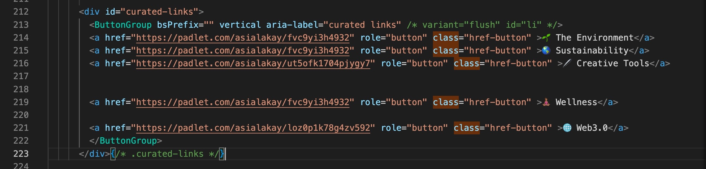

Console Debugging Clues: 

<!--truncate-->

"the regular expression \s matches a single whitespace character, 
[source: What is %s in regex?](https://gufosaggio.net/info/15838/what-is-s-in-regex)

Solution: change all instances of `class` to `className`