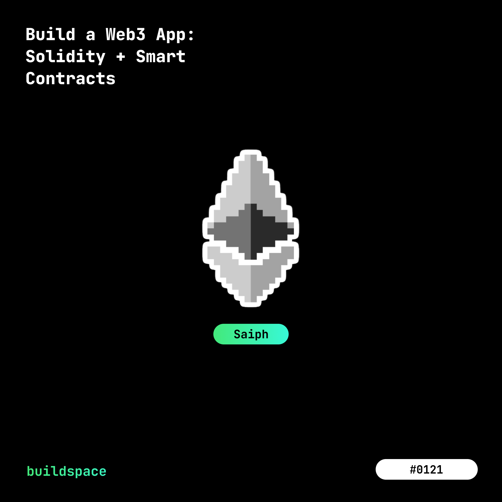

So, I've completed the [buildspace.so](https://buildspace.so/) "Building a Web3 app with Solidity" project. Whoop de whoop!!!

They rewarded me with a [cyuteee NFT](https://opensea.io/assets/matic/0x3cd266509d127d0eac42f4474f57d0526804b44e/20022?utm_source=buildspace.so&utm_medium=buildspace_profile) on OpenSea! (pictured below) 

Here's the UI (mobile view)

~~Want to test it out?~~ Unfortunately, the contract is out of funds. But you can still view transactions on the blockchain and view the UI.  
- [Click here](https://wave-portal-app-six.vercel.app/). 
- Make sure you have MetaMask installed. [Click here](https://asialakay-docs-asiakayy.vercel.app/installing-metamask) for instructions on installing the digital wallet.
- Fund the wallet.

It's deployed on [Etherscan Rinksby Testnet Network](https://rinkeby.etherscan.io/address/0x16061e5eda9307b271c490e00e63be043189d8b5), so no need to spend any actual cash. If you need a testnet, I've found chainlink's testnet to be reliable and quick. 

[faucets.chain.link/](https://faucets.chain.link/)

More on Chainlink coming soon. But for now, if you need to fund your testnet wallet, I recommend their Rinkeby faucet as it's been working better for me than others that I've tried. Also, the User Interface is easy to navigate and pleasantly easy on the eyes. 

:::note
There is a bug in my code where after clicking on the "Confirm" button shows the contract to be classified as "Unapproved". But, clicking on the data row that says "Unapproved", you will be prompted to confirm once more. At that point, the block will be mined and the transaction confirmed.  
:::

:::info 
I learned of a way to deploy smart contracts that can be [upgraded through OpenZeppelin](https://docs.openzeppelin.com/learn/upgrading-smart-contracts#limitations-of-contract-upgrades). The next Smart contract project deployment will definitely have to take advantage of this functionality to keep a project like this testable!
::: 

Here are the links to the... 
- Solidity Blockchain Smart Contract: https://replit.com/@asiakay/my-wave-portal#.replit
- App.js Front-end code: https://github.com/asiakay/wave-portal-app/blob/main/src/App.js
- Deployed React App: https://wave-portal-app-six.vercel.app/

<!-- Any advice would be appreciated. 

Ask and ye shall receive! 

Clue #1!
- Did I call the contracts .wave() function twice inside the frontend wave function? 
    - Yes! `await wavePortalContract.wave("WavePortal", { gasLimit: 30000 });`
        - The first time awaiting the promise on the wavePortalContract
    - Then `const waveTxn = await wavePortalContract.wave(messageText);`
        - when assigning the messageText parameter to the waveTxn variable

Oh! so it uses gas twice the more times the .wave() is referenced?
Solutions: 
- add a higher gas limit. (waste of money)
- remove the gas limit because MetaMask sets one automatically.
- check the scope of the frontend wave function.. a semicolon closing the scope was missing 

TEST 
Estimated Gas Fee 1 Before gasLimit removed

Estimated Gas Fee 2 After gasLimit removed 

Estimated Gas Fee 3 After Contract Unapproved 

Transactions mined successfully - Why does it still say, "Contract Unapproved"

Cool, #Progress... 
BUT on the next transaction, metamask returned contract unapproved, and transaction failed with message in the console... 

AND the transaction on Etherscan showed: 

TEST 
Moved get all waves function above waves function 
 -->

<!-- Btw, it's easy to be afraid of blockchain projects and crypto right now. Gas prices are rising with no end in sight. Warren Buffet advises investors to, "Be fearful, when others are greedy, and greedy when others are fearful".

 I may not have his bank account, or even his change drawer but in my humble experience, I say, keep the faith, invest responsibly, but above all do your own research. 
 
 Personally, I'm going to be looking more into developing with this project, because, IMO, Chainlink has some game changing use cases. 

Through oracles, it connects smart contracts with real world data feeds and APIs. The way I understand it, this functionality has the power to fight disinformation and the potential to increase transparency in business, governement, and supply chains in an automated and data driven way.

It's been a while since I've posted on my Web3 blog, TIL, but perhaps the next blockchain/crypto project to review might be on chainlink accompanied by project documentation on here on the Asialakay // Dev blog. -->

