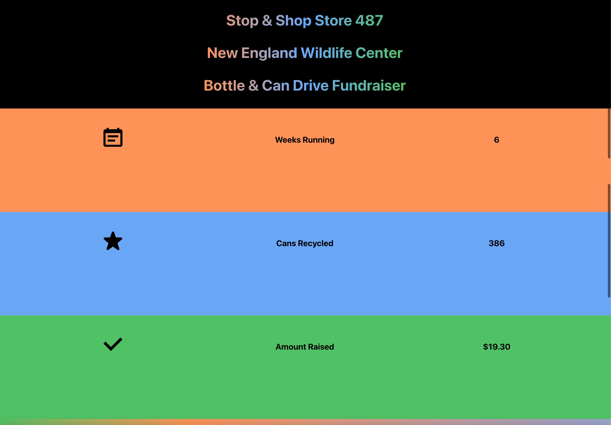

### Outcome ### 
Print flyer that: 
- Thanks employees for participating
- Presents qr code link to web application

Web application that: 
- Provides update on fundraiser
- Presents survey asking for input on next actions & suggestions
  
### Inputs: ### 
- Designed & printed flyer 
- QR code linking flyer to application 
- Info on what the funds are going towards 
- Info on how many items have been recycled
- Info on how much has been raised so far
- Form with 
    - goal amount select for reaching towards 
    - place to share comments, questions, and suggestions

### Concerns/Conditions: ### 
UX/UI should:
- Thank users for participation
- Reiterate the purpose of the fundraiser
- Be accessible to employees only
- Display the qr code large enough to be scanned easily

### Examples/Sources/Inspiration: ### 
Content
- [How to Write a Fundraiser Update](https://www.gofundme.com/c/fundraising-tips/update)

Technical Tools
- [Figma](https://www.figma.com/)
- [EPS to SVG Converter](https://cloudconvert.com/eps-to-svg)
- [Remove the background from images for free](https://www.adobe.com/express/feature/image/remove-background)
- [Create React App](https://create-react-app.dev/)
- [CSS Gradient Text Generator](https://www.cssportal.com/css-text-gradient-generator/)
- [CSS Gradient Background Generator](https://cssgradient.io/)
- [Chakra UI](https://chakra-ui.com/)
- [How to format dates in ReactJS](https://codesource.io/how-to-format-dates-in-reactjs/)
- [QR Code & Barcode Scanner](https://apps.apple.com/us/app/qr-code-barcode-scanner/id1048473097)

# Creating the UX & UI
- First, I designed the flyer in Figma using specified flyer dimensions. 

- Then for the web application, created a basic UI prototype in Figma 
- Next, created a new React Application 
`npx create-react-app bottle-drive-fundraiser`
- Manually installed ChakraUI 
    - With NPM `npm i @chakra-ui/react @emotion/react@^11 @emotion/styled@^11 framer-motion@^6`
    - Set up the ChakraProvider at the root of the application in index.js
        - 1. imported `ChakraProvider` component
        - 2. Wrapped ChakraProvider at the root of the app
    - Installed Chakra UI icons 
        - `npm i @chakra-ui/icons`
        - imported selected icons in App.js
        - Used the `boxSize` prop to change the icon sizes
    - Created & styled form
        - using [formspree](https://formspree.io/) for backend processing
        - using React [useForm hook](https://react-hook-form.com/api/useform/) and event listeners to handle the change in form data's state.
    - Installed Chakra UI Buttons
        - `npm i @chakra-ui/button`
    - Installed Formspree to process Form 
    - Added current date to application with Moment Library
    `npm install --save moment` [package info](https://www.npmjs.com/package/moment)
    - Deployed web application to Vercel for hosting
    - Created qr code linking to web application with the [QR Code & Barcode Scanner](https://apps.apple.com/us/app/qr-code-barcode-scanner/id1048473097) app on iphone.
    - Added qr code to flyer  

### Web Application Screenshot ###

