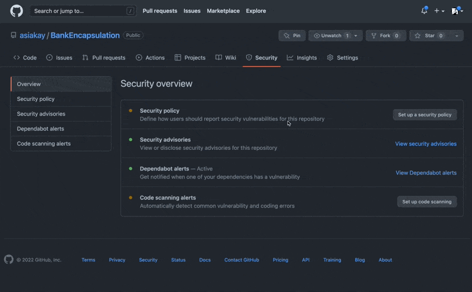

Today, I opened my gmail account to find a message with the subject line that read
>"A security advisory on Newtonsoft.Json affects at least one of your repositories"

On opening the email, here's what I found: 

Clicking on the view all alerts button took me to: 

Dependabot???? What's this? 

>"Dependabot checks for outdated dependencies as soon as it's enabled. You may see new pull requests for version updates within minutes of adding the configuration file, depending on the number of manifest files for which you configure updates."

:::info 
For more info on Dependabot and automatic detection of security vulnerabilities, [click here](https://docs.github.com/en/code-security/dependabot/dependabot-version-updates/configuring-dependabot-version-updates)
:::

Clicking on the vulnerabilties tab provided the following details:

Another view of the problem was found in the repository's Security Overview tab:

There is also a notification for Pull Requests, here is what it shows: 

The screencast below shows the pull request initiated by GitHub's dependabot being merged into the main branch: 

Upon completion of addressing the security vulnerability, I reopened the security overview tab and set up code scanning to enable automatic detection of common vulnerability and coding errors as shown below. 

In conclusion, to help further defend against security vulnerabilites we have:  
- 1) clicked the button to set up CodeQL alerts which triggered the creation of a workflow with the `codeql-analysis.yml` file in a hidden github folder (`.github/workflows`)
- 2) committed the file to the main branch of the repository

IMO, this goes to show that errors happen and code breaks, but remaining vigilant and investigating ways to prevent code from breaking in the future can lead to increased efficiency and protection. 