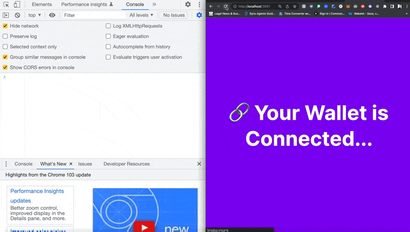
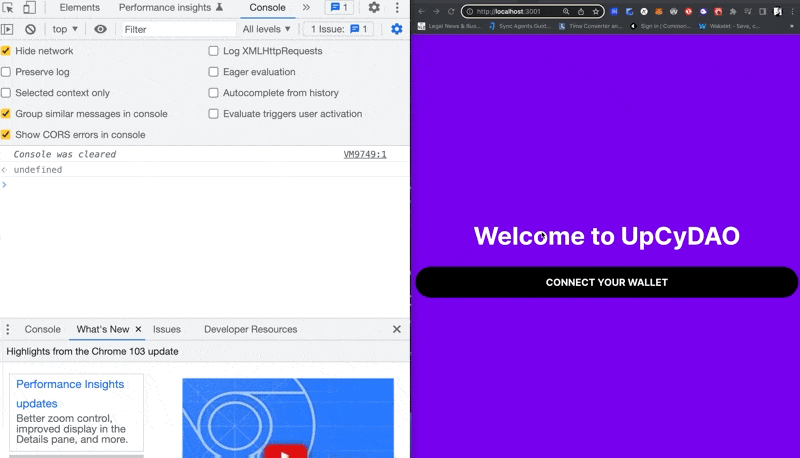
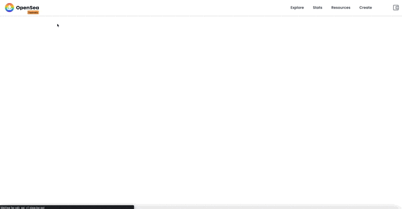
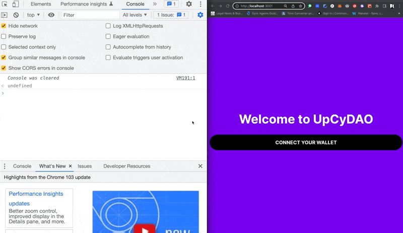
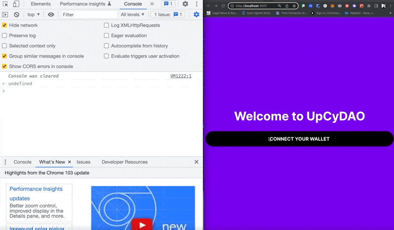

# Building a DAO #


## What is $%@# is a DAO? ## 

DAO stands for Decentralized Autonomous Organization. Let's break that down. 

Decentralized means peer-to-peer across a network as opposed to centralized which means belonging to a single entity i.e. Facebook, Amazon, Netflix, and Google among others. 

An autonomous organization in this context means that the governance of the organization is automated through smart contracts on the blockchain. 

A DAO is a structure that offers businesses and communities the choice to govern themselves and manage their finances in a democratic manner. 

The first DAO was named, "The DAO" and "was built using smart contracts, used an open-source framework, and focused on venture capitalism."

Unfortunately it lost millions of ETH, 3.6 to be exact, because of a bug that was exploited in the smart contract. 

Other DAO's that followed were able to learn from this mistake and went on to become successful projects. 

According to Alchemy.com, there are 8 main types of DAO's. 

1. Protocol DAOs : govern decentralised protocols including borrow/lending applications, decentralized exchanges, and other types of dapps (decentralized applications)
2.  Grant DAOs : facilitate nonprofit donations
3.  Philanthropy DAOs : organize around a shared purpose
4.  Social DAOs : bring together like minded individuals
5. Collector DAOs : facilitate the purchase of NFT art and other collectables in which each member owns shares 
6. Venture DAOs : pool finances to invest in early stage web3 startups and off chain investments 
7. Media DAOs : produce content in which the members have access to the profits 
8. SubDAOs : manage specific functions including operations, partnerships, marketing, treasury and grants. 


References: 
[The 8 Most Important Types of DAOs You Need to Know](https://www.alchemy.com/blog/types-of-daos)


This is a very simplistic definition of a DAO but for the purpose of documenting this project, this is all we need to know for now. 


The DAO that I will be documenting the creation of is: 

>UpCyDAO - a DAO for creators that upcycle sustainable and previously used materials for upcycling into new products and works of art. Members receive $UpCy when they interact with the community, providing advice, resources, and examples of how to upcycle non-biodegradeable materials that might otherwise end up in landfills.


User Stories
- Users can connect their wallet 
- Users can mint a membership NFT
- Users can receive a token airdrop 
- Users can vote on proposals 

<!-- IDE : Replit.com 

We're building this project as a part of a Buildspace.io Hackathon. They've provided a basic react project that to fork, which I've forked [here](https://replit.com/@asiakay/buildspace-dao-starter-v2#src/App.jsx) -->

IDE : VSCode

We're building this project as a part of a Buildspace.so Hackathon. They've provided a basic react project  to fork, which I've forked [here](https://replit.com/@asiakay/buildspace-dao-starter-v2#src/App.jsx)

For familiarites sake, I've decided to build locally. The starter code was forked and cloned from the github repo [here](https://github.com/buildspace/buildspace-dao-starter?utm_source=buildspace.so&utm_medium=buildspace_project) to [my GitHub account here](https://github.com/asiakay/upcy-dao)
 

Running `npm start` returned: 

<!--  -->

This happened because I skipped the step of entering `npm install` for adding node modules.

We've already installed our Ethereum wallet of choice, MetaMask, in the browser. This is neccessary in order to call functions on the smart contract on the blockchain because we will need a private key to authenticate the requests.

Since I'm working with test Eth, I've selected the Rinkeby Test Network vs. Ethereum Mainnet. As mentioned in the previous posts, I'll be requesting test Eth from Chainlink's faucet [here](https://faucets.chain.link/rinkeby).


Here's a screenshot of my MetaMask Wallet with some test Eth. 

<!-- 
 -->
Connecting the Wallet to the DAO Dashboard 

Unlike the previous project, we'll be using [thirdweb’s front-end SDK](https://portal.thirdweb.com/guides/sdk-guide) to build our connect to wallet button. The steps required are: 

- in index.jsx
    - import thirdweb provider ...
    `import { ChainId, ThirdwebProvider } from '@thirdweb-dev/react';`
    - create var for the chainID that the dApp is working on
    `const activeChainId = ChainId.Rinkeby;`
    - wrap the app with the thridweb provider 
```JSX
    ReactDOM.render(
  <React.StrictMode>
    <ThirdwebProvider desiredChainId={activeChainId}>
      <App />
    </ThirdwebProvider>
  </React.StrictMode>,
  document.getElementById('root'),
);
```
Then, in `App.jsx` I added:
- `import { useAddress, useMetamask } from '@thirdweb-dev/react';` 
- in the `const App` function, I added variables and thirdweb provided hooks: 
    - ```JSX

        const address = useAddress();
        const connectWithMetamask = useMetamask();
        console.log("💯 Address:", address);
    ```
- created `if` statement for the case where a user hasn't connected a wallet to the app, then `return` a "Connect Your Wallet" button. 
```JSX
  if (!address){
    return (
      <div className="landing">
        <h1>Welcome to UpCyDAO</h1>
        <button onClick={connectWithMetamask}className="btn-hero">Connect Your Wallet</button>
</div>  
```
- added return statement for the case where the user's wallet is connected. 

Here is a screenshot of the wallet connecting to MetaMask. 

<!-- 
 -->
[x] ~~User Story 1.~~ Users can connect their wallet 

<!-- Members receive $UpCy when they create works of art from nonbiodegradeable materials that might otherwise end up in landfills. -->


With User Story 1 complete, it's time to move on to the next - Users can mint a membership NFT that allows them to join the DAO. In this step, if users do not have a membership NFT already, then they will have the opportunity to mint the membership NFT and join the DAO. To do this, I need to write and deploy an NFT contract. 

While Solidity is amazing, I'll be using thirdWeb to allow the creation and deployment of the contract with JavaScript.

First, I've created a .env file to store the private keys using the environmental variables below: 

```Bash
PRIVATE_KEY=YOUR_PRIVATE_KEY_HERE
WALLET_ADDRESS=YOUR_WALLET_ADDRESS
ALCHEMY_API_URL=YOUR_ALCHEMY_API_URL
```

The `PRIVATE_KEY` was exported from MetaMask. `WALLET_ADDRESS` is my MetaMask wallet address. 
Getting the `ALCHEMY_API_URL` came from creating a new app on [Alchemy.com](alchemy.com) - making sure to select Ethereum and Rinksby Testnet. 

Next, Initialize SDK

In `scripts/1-initialize-sdk.js`
- added the following import statements
```JavaScript
import { ThirdwebSDK } from "@thirdweb-dev/sdk";
import ethers from "ethers";
import { dotenv } from "dotenv";
```
- called the `.config()` method on the dotenv object with `dotenv.config`
- added checks to mae sure the .env file is configured correctly  
<!-- - for const provider, used the Alchemy API URL from our .env file. // RPC URL, we'll use our Alchemy API URL from our .env file.
(look up RPC URL) -->
- initiated vars for provider, wallet and sdk
- added `async` function, created var to `await` for address to be called through `.getSigner()` and `getAddress()` on the sdk object 
- exported the initialized thirdweb SDK to use on other scripts 

On entering `node scripts/1-initialize-sdk.js` in the terminal to run the script, it returned: 

```Bash 
SyntaxError: Named export 'ThirdWebSDK' not found. The requested module '@thirdweb-dev/sdk' is a CommonJS module, which may not support all module.exports as named exports.
CommonJS modules can always be imported via the default export, for example using:

import pkg from '@thirdweb-dev/sdk';
const { ThirdWebSDK } = pkg;
```

This turned out to be a typo, because the correct line is `import { ThirdwebSDK } from "@thirdweb-dev/sdk";` Lettercase matters. 

On entering `node scripts/1-initialize-sdk.js` again, it returned: 

```Bash
SyntaxError: Named export 'dotenv' not found. The requested module 'dotenv' is a CommonJS module, which may not support all module.exports as named exports.
CommonJS modules can always be imported via the default export, for example using:

import pkg from 'dotenv';
const { dotenv } = pkg;
```

Then I remembered that I never installed the [dotenv npm package](https://www.npmjs.com/package/dotenv). 

That wasn't the issue because the same message outputted in the terminal. Turns out, it was because I typed a scope around the `dotenv` in the import statement. 

With the errors corrected, typing `node scripts/1-initialize-sdk.js` into the terminal returned: 

```Bash
SDK initialized by address: 0x1eD6025c5c6859337bFbe15Cd64b30FF88962605
```
This shows that the initialization worked. 

### 🧨 Create an ERC-1155 collection ### 

An ERC-1155 is an NFT type where each NFT is the same as opposed to an ERC-721 where each token is unique. 

In `scripts/2-deploy-drop.js`:
- gave the collection a name, description, primary_sale_recipient, and image
 - created an image and saved the image  in the `scripts/assets` folder 

Ran the script `node scripts/2-deploy-drop.js` in the terminal and got: 

```Bash
SDK initialized by address: 0x1eD6025c5c6859337bFbe15Cd64b30FF88962605
Successfully deployed editionDrop contract, address: 0xd844F24e6916C3cc569FaAE9FfD2aD9e9bCCe772
Successfully deployed editionDrop metadata: {
  name: 'UpCyDAO Membership',
  description: 'A DAO for upcycling enthusiasts.',
  image: 'https://gateway.ipfscdn.io/ipfs/QmbhN1evA8XNrbM3J67zheJVpsVrGq9EGWH8XjawPNHAPT/0',
  seller_fee_basis_points: 0,
  fee_recipient: '0x0000000000000000000000000000000000000000',
  merkle: {},
  symbol: ''
}
```

Here's a screenshot of the deployed contract:

<!--  -->

The ERC-1155 contract was deployed to Rinkeby and can be viewed andinteracted with by [clicking here](https://rinkeby.etherscan.io/address/0xd844F24e6916C3cc569FaAE9FfD2aD9e9bCCe772) - and for the contract creator, on the [thirdweb dashboard](https://thirdweb.com/dashboard).

<!-- 
 -->
:::note
thirdWeb automatically pins the collection image to ipfs (interplanetary file storage), a decentralized storage solution. The ipfs address cannot be viewed in Chrome's browser, but can be viewed in the Brave browser.
:::

In the previous steps, I've created the ERC-1155 contract and added some basic metadata.

The next step is to deploy NFT metadata, by setting up our membership NFTs.

---
### LaztMint the NFT to the contract ###

The NFT below will give you access to UpCyDAO: 


`node scripts/3-config-nft.js`
```Bash
SDK initialized by address: 0x1eD6025c5c6859337bFbe15Cd64b30FF88962605
Successfully created a new NFT in the drop!
```

`import sdk from "./1-initialize-sdk.js";`

Accessed the ERC-1155 `editionDrop` contract.

`const editionDrop = sdk.getEditionDrop("INSERT_EDITION_DROP_ADDRESS");`

`import sdk from "./1-initialize-sdk.js";
import { readFileSync } from "fs";

const editionDrop = sdk.getEditionDrop("0xd844F24e6916C3cc569FaAE9FfD2aD9e9bCCe772");

```JSX
(async () => {
    try {
        await editionDrop.createBatch([
            {
                name: "UpCy Bot",
                description: "this NFT will give you access to UpCyDAO",
                image: readFileSync("scripts/assets/upcy.png"),
            },
        ]);
        console.log("Successfully created a new NFT in the drop!");
    } catch (error) {
        console.error("Failed to create the new NFT.", error);
    }
})();
```
- `editionDrop`: "[0xd844F24e6916C3cc569FaAE9FfD2aD9e9bCCe772](https://rinkeby.etherscan.io/address/0xd844F24e6916C3cc569FaAE9FfD2aD9e9bCCe772)

<!-- 
 -->
<!--  -->

`createBatch` sets up the nft on the erc-1155 contract address

All members will receive: 

A membership NFT 

<!-- 
 -->

😼 Setup claim condition

In `scripts/4-set-claim-condition.js`:

`startTime: new Date()`, 
condition where the users is allowed to start minting an NFT : set to the current date and time. 

`maxQuantity: 50_000`,
the max # of membership NFTs that can be minted.

`quantityLimitPerTransaction: 1`,
the number of transactions that a user can mint at a time has been set to `1` to allow the minting of one NFT membership at a time.

`price: 0`,
means that the price is set at 0 (Free.99) 

:::note
`waitInSeconds: MaxUint256`,
" amount of time between transactions ... 
the maximum number that the blockchain allows." ???
:::

:::info
`await editionDrop.claimConditions.set("0", claimConditions);`
adjusts the condiditons of the [deployed contract: @0xd844f24e6916c3cc569faae9ffd2ad9e9bcce772](https://rinkeby.etherscan.io/address/0xd844f24e6916c3cc569faae9ffd2ad9e9bcce772) on-chain. 
 
 `0` is passed as the tokenId as it's the first NFT in our ERC-1155 contract. For a different set of NFTs in the collection i.e. for a tier of user, this can be set `1`, `2` etc for each new set ... 
:::

Ran, `node scripts/4-set-claim-condition.js`
And it returned: 

```Bash
SDK initialized by address: 0x1eD6025c5c6859337bFbe15Cd64b30FF88962605
Successfully set claim condiiton.
```

results, available on the thirdWeb dashboard
- deployed smart contract with specifc rules to follow including
  - date of mint/new membership tied to NFT
  - a maximum quantity of NFTs to be minted/printed into existence
  - the amounth of transactions allowed to be conducted at a time
  - the price to be paid for the NFT
  - the amount of time between transactions

  Originally Printed at asialakay-docs.


```Bash
SDK initialized by address: 0x1eD6025c5c6859337bFbe15Cd64b30FF88962605
Successfully created a new NFT in the drop!
(base) @mbp upcy-dao %node scripts/4-set-claim-condition.js
SDK initialized by address: 0x1eD6025c5c6859337bFbe15Cd64b30FF88962605
Successfully set claim condiiton.
```

copy-pasted the bundle drop address printed out / minted on [etherscan](https://rinkeby.etherscan.io/address/0xd844f24e6916c3cc569faae9ffd2ad9e9bcce772)


<!-- 
 -->

Let users mint your NFTs.
Users can mint a membership NFT.

in `App.jsx`
>"if we detect that our user has a membership NFT, show them our "DAO Dashboard" screen where they can vote on proposals and see DAO related info.

if we detect that the user doesn't have our NFT, we'll give them a button to mint one."

added thirdWeb's useEditionDrop hook... 

`import { useAddress, useMetamask, useEditionDrop } from '@thirdweb-dev/react';`

and `{ useState, useEffect } from 'react';`

then initialized the `editionDrop` contract in a variable 

`const editionDrop = useEditionDrop("0xd844F24e6916C3cc569FaAE9FfD2aD9e9bCCe772");`

Here is where I checked if the user has the membership NFT with the line, 

`const balance = await editionDrop.balanceOf(address, 0);`

`"0"` is used in the callback because it is the `tokenId` of the membership NFT. 

Here is the full code of App.jsx so far:

```JSX
import { useAddress, useMetamask, useEditionDrop } from '@thirdweb-dev/react';
import { useState, useEffect } from 'react';

const App = () => {

  const address = useAddress();
  const connectWithMetamask = useMetamask();
  console.log("💯 Address:", address);

    // Initialize our editionDrop contract
  const editionDrop = useEditionDrop("0xd844F24e6916C3cc569FaAE9FfD2aD9e9bCCe772")
  // State variable for us to know if user has our NFT.
  const [hasClaimedNFT, setHasClaimedNFT] = useState(false);

  useEffect(() => {
    if (!address){
      return;
    }

    const checkBalance = async() => {
      try {
        const balance = await editionDrop.balanceOf(address, 0);
        if (balance.gt(0)){
          setHasClaimedNFT(true);
          console.log("🌚 This user has a membership NFT.");
        } else {
          setHasClaimedNFT(false);
          console.log("This user doesn't have a membership NFT...");
        }
      } catch (error){
        setHasClaimedNFT(false);
        console.log("Failed to get balance", error);
    }
  };
  checkBalance();
}, [address, editionDrop]);

  if (!address){
    return (
      <div className="landing">
        <h1>Welcome to UpCyDAO</h1>
        <button onClick={connectWithMetamask} className="btn-hero">Connect Your Wallet</button>
</div>    
    );
  }

  return (
    <div className="landing">
      <h1>🔗 Your Wallet is Connected...</h1>
    </div>
  );
};

export default App;
```


Here's what it looks like in the console




✨ Building the "Mint NFT" button

Here is the code added to render the "Mint NFT Button"

```JSX
  return (
    <div className="mint-nft">
      <h1>Mint your free 🍪DAO Membership NFT</h1>
      <button
        disabled={isClaiming}
        onClick={mintNft}
      >
        {isClaiming ? "Minting..." : "Mint your nft (FREE)"}
      </button>
    </div>
  );
  ```

  Here is the NFT minting process: 

  

  Here is the UX/UI so far

  


  Here are the transaction details on the blockchain explorer

  

The DAO and NFTs have now been minted on the [opensea testnet @ testnet.opensea.io](https://testnets.opensea.io/collection/upcydao-membership)



### 🛑 Showing the DAO Dashboard only if user owns the NFT ### 

```JSX
  // if the user has minted the NFT - this will render 
  if (hasClaimedNFT){
    return (
      <div className='member-page'>
        <h1>UpCyDAO Member Page</h1>
        <p>🎊 Congrats on being a member 🎊</p>
      </div>
    )
  }
  ```

The code added to `App.jsx` states that if the dApp detects the user has a membership NFT, it will render a "DAO Dashboard" screen visible only to holders of the ERC-1155 NFT.




Otherwise, if the the dApp detects that the user does not have the membership NFT, I want to render a button for them to mint one. 

To test the dApp for the case where the user does not own a membership NFT, I've created a new MetaMask Account following the [instructions provided here](https://metamask.zendesk.com/hc/en-us/articles/360015289452-How-to-create-an-additional-account-in-your-MetaMask-wallet?utm_source=buildspace.so&utm_medium=buildspace_project). 


`0xC6cC274B9d1d1c43f56944Cb43A8C8465526cCFf`

In MetaMask, I disconnected the main account in order to allow a fresh connect wallet button to render on screen. However, there were insufficient funds to mint 😿. 



No problem, headed over to the [chainlink faucet](https://faucets.chain.link/) to add test eth to the new account. Making sure to select the new wallet to add it to. 


All the parts are connected and tested!


[Click here](https://testnets.opensea.io/assets/rinkeby/0xd844f24e6916c3cc569faae9ffd2ad9e9bcce772/0) to view the NFT on Opensea!

At this point, I'm halfway there in completing the User stories.

User Stories
- Users can connect their wallet [x]
- Users can mint a membership NFT [x]

For a live demo, and to mint a membership token for free, go to [https://upcy-dao.vercel.app/](https://upcy-dao.vercel.app/)

The code for what has been built up to this point can be found by [clicking here](https://github.com/asiakay/upcy-dao/tree/dce5fbaff391919e2cda1189f306f256353b7760).


Next, will be completing the super exciting parts dealing with creating tokens and governance! In the next section, the following User stories will be completed.  

- Users can receive a token airdrop 
- Users can vote on proposals 


<!-- (https://thirdweb.com/dashboard/rinkeby/edition-drop/0xd844F24e6916C3cc569FaAE9FfD2aD9e9bCCe772?tabIndex=0). 

Resources
[https://commons.wikimedia.org/wiki/File:Recycling_symbol.svg](https://commons.wikimedia.org/wiki/File:Recycling_symbol.svg)

[https://www.wbur.org/news/2022/03/15/modernizing-bottle-bill-plastic-recycling](https://www.wbur.org/news/2022/03/15/modernizing-bottle-bill-plastic-recycling)

[https://www.alchemy.com/blog/types-of-daos](https://www.alchemy.com/blog/types-of-daos) -->

REFERENCES & SOURCES

- [buildspace.so](https://www.buildspace.so)
- [thirdWeb Docs](https://portal.thirdweb.com/)
- [The 8 Most Important Types of DAOs You Need to - Know | Alchemy.com](https://www.alchemy.com/blog/types-of-daos)
- [Figma](https://www.figma.com/file/ZGY37BnQHbFywMA74ykGM7/UpCyDAO?node-id=0%3A1)
- [Bottle vector image | FreeSVG.org](https://freesvg.org/bottle-vector-image)
