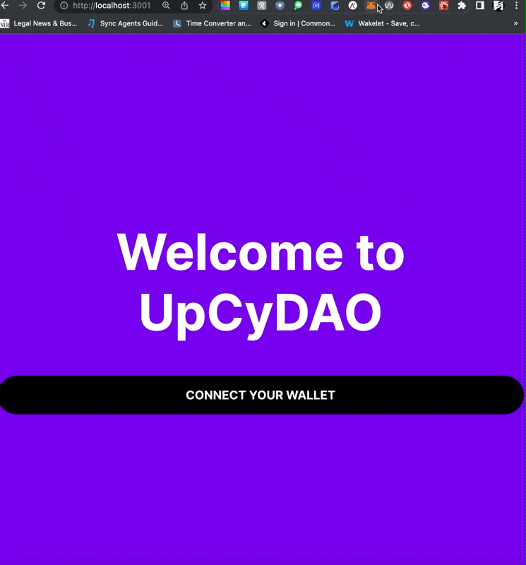
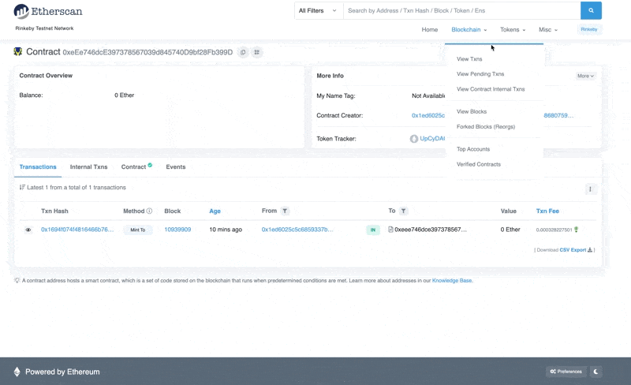
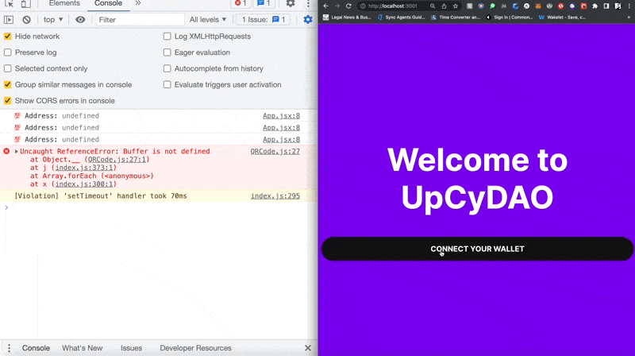
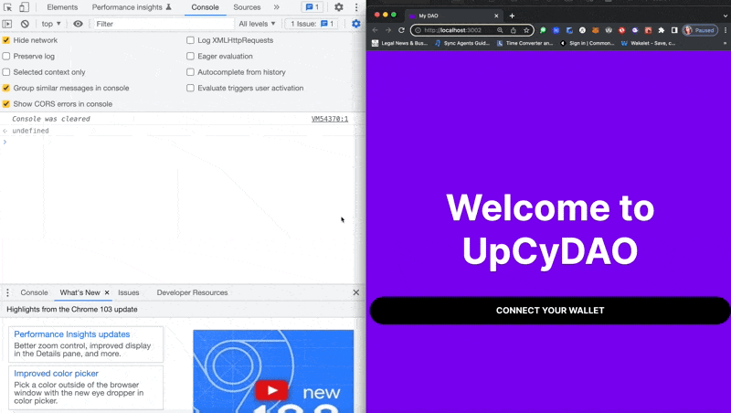

# Building a DAO (Part Two) #


In [Building a DAO (Part One)](https://asialakay-docs-asiakayy.vercel.app/building-a-dao-with-JavaScript-1) the following user stories were fulfilled: 

- Users can connect their web3 wallet [x]
- Users can mint a membership NFT [x]

To fulfill these requirements, an ERC-1155 collection was created on the blockchain. 
To view the Membership NFT on Opensea, [click here](https://testnets.opensea.io/assets/rinkeby/0xd844f24e6916c3cc569faae9ffd2ad9e9bcce772/0).

As holders of the Membership NFT, users have access to the DAO.  

In this session, the last two user stories will be fulfilled... 

- Users will receive a token airdrop
- Users will be able to vote on proposals

## Deploying the ERC-20 token smart contract ## 

In order to do a token airdrop, in `scripts/5-deploy-token.js`, I've created an [ERC-20 token smart contract](https://docs.openzeppelin.com/contracts/2.x/api/token/erc20?utm_source=buildspace.so&utm_medium=buildspace_project) with the [code](https://github.com/asiakay/upcy-dao/blob/63d09f81741c85ad303072c631bbcb4b5b87f847/scripts/5-deploy-token.js) shown below.

```JavaScript
import { AddressZero } from '@ethersproject/constants';
import sdk from './1-initialize-sdk.js';

(async () => {
    try {
        // deploying a standard ERC-20 contract
        const tokenAddress = await sdk.deployer.deployToken({
            // Giving the token a name 
            name: "UpCyDAO Governance Token",
            // Giving the token a symbol
            symbol: "UPCY",
            // because the token is not for sale, it's set to be received by AddressZero
            primary_sale_recipient: AddressZero,
        });
        console.log(
            "🍹 Successfully deployed token module, address:",
            tokenAddress,  
        );
    } catch (error) {
        console.error("😝 failed to deploy token module", error);
    }
})();
```


`node scripts/5-deploy-token.js`

returns and confirms! 
```Bash
SDK initialized by address: 0x1eD6025c5c6859337bFbe15Cd64b30FF88962605
🍹 Successfully deployed token module, address: 0xeEe746dcE397378567039d845740D9bf28Fb399D
```

<!-- (create a supply of governance token) -->
Here's the ERC-20 token smart contract on [https://rinkeby.etherscan.io/](https://rinkeby.etherscan.io/address/0xeEe746dcE397378567039d845740D9bf28Fb399D)


Here's a screencap of how I imported the $UPCY into my MetaMask wallet using the contract address. 



### 😜 Creating the token’s supply ###

With the [code](https://github.com/asiakay/upcy-dao/blob/a85b999d9d178c477f25ba53dfe62f576c5e16c9/scripts/6-print-money.js) shown below, in `scripts/6-print-money.js`, I told the contract how many tokens are available for circulation.

```JavaScript
import sdk from "./1-initialize-sdk.js";

const token = sdk.getToken("0xeEe746dcE397378567039d845740D9bf28Fb399D");

(async () => {
    try {
        // max token supply
        const amount = 1_000_000;
        // interact with the deployed ERC-20 contract and mint the tokens
        await token.mintToSelf(amount);
        const totalSupply = await token.totalSupply();

        // printing to the console how many tokens now exist
        console.log("💸 There are now ", totalSupply.displayValue, "$UPCY in circulation");  
    } catch (error){
        console.error("😿 Failed to print money", error);  
    }
})();
```

Running `node scripts/6-print-money.js` returns: 

```Bash
SDK initialized by address: 0x1eD6025c5c6859337bFbe15Cd64b30FF88962605
💸 There are now  1000000.0 $UPCY in circulation
```
Below is the view from the thirdWeb dashboard


The view from [https://rinkeby.etherscan.io](https://rinkeby.etherscan.io/token/0xeEe746dcE397378567039d845740D9bf28Fb399D) allows me to track the governance tokens in circulation. 




### 💸 Airdropping the governance token ###

To fulfill the third user story where users will receive a token airdrop. I had to code a script that allowed randomly selected owners of the membership token to be able to receive the airdrop. 

<!-- (create a formula for rewarding members with governance tokens) -->


```JavaScript
import sdk from './1-initialize-sdk.js';

// initializing the address of the ERC-1155 membership NFT contract and 
// initializing the address of the ERC-20 token contract 

const editionDrop = sdk.getEditionDrop("0xd844F24e6916C3cc569FaAE9FfD2aD9e9bCCe772");

const token = sdk.getToken("0xeEe746dcE397378567039d845740D9bf28Fb399D");

(async () => {
    try {
        // getting the addresses of DAO members holding the tokenId(0)
        const walletAddresses = await editionDrop.history.getAllClaimerAddresses(0);

        // if there are no wallet addresses in the history of all claim addresses then write it to the console 
        if (walletAddresses.length === 0){
            console.log(
                "No NFTs have been claimed yet, get some folks to claim some for free!",
            );
            process.exit(0);
        }

    // Looping through the array of addresses with a map() function
    const airdropTargets = walletAddresses.map((address) => {
        // picking a random # between 1000 and 10000
        const randomAmount = Math.floor(Math.random() * (10000 - 1000 +1) + 1000);
        console.log("✈ Going to airdrop", randomAmount, "tokens to", address);  

        // setting up the target for the drop, storing in the airdropTarget dictionary
        const airdropTarget = {
            toAddress: address,
            amount: randomAmount,
        };
        return airdropTarget;
    });

    // calling transferBatch on each mapped address in the airdroptargets var
    console.log("Starting airdrop...");
    await token.transferBatch(airdropTargets);
    console.log("🖼 Successfully airdropped tokens to all membership NFT holders!");
} catch (err){
    console.log("😿 Failed to airdrop tokens.", err);
}
})();
```

Running `node scripts/7-airdrop-token.js` in the terminal returns:

```Bash
SDK initialized by address: 0x1eD6025c5c6859337bFbe15Cd64b30FF88962605
✈ Going to airdrop 1313 tokens to 0x1eD6025c5c6859337bFbe15Cd64b30FF88962605
✈ Going to airdrop 9015 tokens to 0xC6cC274B9d1d1c43f56944Cb43A8C8465526cCFf
Starting airdrop...
🖼 Successfully airdropped tokens to all membership NFT holders!
```

After the airdrop, the thirdweb dashboard displays the remaining amount of governance tokens that I currently own. 


On the [testnet explorer](https://rinkeby.etherscan.io/token/0xeEe746dcE397378567039d845740D9bf28Fb399D), how many governance tokens are held by how many and by which wallet addresses. 


Users with governance tokens, have voting privelidges. 

### Retrieve token holders and token balances ###

In `App.jsx` ... 

Updated the import statements as follows, 

```JSX
import { useAddress, useMetamask, useEditionDrop, useToken } from '@thirdweb-dev/react';
import { useState, useEffect, useMemo } from 'react';
```

Then.. 

... added the token address under `editionDrop`

`const token = useToken("0xeEe746dcE397378567039d845740D9bf28Fb399D");`

The ERC-1155 contract contains all the member wallet addresses, while the ERC-20 asset contains the information regarding the number of governance tokens owned by each member. 

```JSX
  // returns all members holding the NFT !hasClaimedNFT??? 
  useEffect(() => {
    if (!hasClaimedNFT){
      return;
    }
    const getAllAddresses = async () => {
      try {
        // references all the members who hold the NFT with the tokenId of 0
        const memberAddresses = await editionDrop.history.getAllClaimerAddresses(0);
        setMemberAddresses(memberAddresses);
        console.log("⚓ Members addresses", memberAddresses);
      } catch (error){
        console.error("🙀 Failed to get member list", error);
      }
    };
    getAllAddresses();
  }, [hasClaimedNFT, editionDrop.history]);
  ```
Calling `getAllClaimerAddresses(0)`, gets the addresses of all members, or holders of the NFT on the ERC-1155 collection contract.


```JSX
 // grabbing the number of tokens each member holds with the useEffect hook
  useEffect(() => {
    if (!hasClaimedNFT){
      return;
    }

    const getAllBalances = async () => {
      try {
        const amounts = await token.history.getAllHolderBalances();
        setMemberTokenAmounts(amounts);
        console.log("💰 Amounts", amounts);
      } catch (error) {
        console.error("😿 Failed to get member balances", error);
      }
    };
    getAllBalances();
  }, [hasClaimedNFT, token.history]);
```

Calling `getAllHolderBalances()`, gets the history of the token holders of the ERC-20 contract's governance token. 

```JSX
// combining the memberAddresses and memberTokenAmounts into a single array
  const memberList = useMemo(() => {
    return memberAddresses.map((address) => {
      // checking if the address is in the memberTokenAmounts array
      // if so, returning the amount of tokens the user has
      // otherwise, returning 0
      const member = memberTokenAmounts?.find(({ holder }) => holder === address);

      return {
        address, 
        tokenAmount: member?.balance.displayValue || "0"
      }
    });
  }, [memberAddresses, memberTokenAmounts]);
  ```


The `memberList` const references the combination of data into one array containing a "cross-referenced" list pairing the data from both contracts - `memberAddresses`(ERC-1155), and `memberTokenAmounts`(ERC-20).

Here is a view from the console output showing holder and their associated balance:


[Review the code on Github at this commit](https://github.com/asiakay/upcy-dao/blob/1d7ec64d457f9d1cd3d24332d595b7a447851088/src/App.jsx)

### View Token holders on the member dashboard ###

```JSX
// if the user has minted the token - this will render 
  if (hasClaimedNFT){
    return (
      <div className='member-page'>
        <h1>UpCyDAO Member Page</h1>
        <p>🎊 Congrats on being a member 🎊</p>
        <div>
          <div>
            <h2>Member List</h2>
            <table className='card'>
              <thead>
                <tr>
                  <th>Address</th>
                  <th>Token Amount</th>
                  </tr>
                  </thead>
                  <tbody>{memberList.map((member) => {
                    return (
                      <tr key ={member.address}>
                        <td>{shortenAddress(member.address)}</td>
                        <td>{member.tokenAmount}</td>
                      </tr>
                    );
                  })}
                  </tbody>
                </table> 
            </div>
        </div>
      </div>
    );
  };
```

The code above shows that if the user has claimed a Membership NFT, then use the `map()` method to cycle through memberList's members and render the list organized by member address (key={member.address}) in one table cell juxtaposed and paired with the value of the member token amount in the next table cell.

Here is a peek at the rendered Member list on the DAO dashboard, viewable by members only! 


[Review the code on Github at this commit](https://github.com/asiakay/upcy-dao/blob/27230c6ff38f30f0fe7b645746775bb945f677b7/src/App.jsx)
### ⚖ Building a treasury + governance ###

Created a governance contract to offer users the chance to let their voices be heard. 
<!-- - automatically counts the votes 
 -->

```JavaScript
import sdk from './1-initialize-sdk.js';

(async () => {
    try {
        const voteContractAddress = await sdk.deployer.deployVote({
            // Giving the governance contract a name
            name: "UpCy DAO Governance Contract",

            // assigning the location property of the governance token (hint it's @ the ERC-20 contract address) 
            voting_token_address: "0xeEe746dcE397378567039d845740D9bf28Fb399D",
            voting_delay_in_blocks: 0,
            // 1 day = 6570 blocks
            voting_period_in_blocks: 6570,
            voting_quorum_fraction: 0,
            proposal_token_threshold: 0,
        });

        console.log("Successfully deployed vote contract, address:",
        voteContractAddress,
        );
    } catch (err){
        console.error("Failed to deploy vote contract.", err);
    }
})();
```

:::info
[Click here](https://github.com/asiakay/upcy-dao/blob/81e24724dcfd2a9a47ba33ef2d2515a9d7bb7316/scripts/8-deploy-vote.js) for the above code commit on GitHub.
:::

Notes on the code above 
- `deployer.deployVote` in the await, sets up the contract 
- `voting_token_address:` detects which ERC-20 token to accept based on the previously deployed ERC-20 token smart contract address. This way the current contract knows to accept $UPCY
- `voting_delay_in_blocks:` creates a pause for users to go over the proposal they are voting on 
- `voting_period_in_blocks:` creates a time limit on which users have before running out of time to vote
- `voting_period_in_blocks:` creates a minimum amount of votes needed for a proposal to pass
- `proposal_token_threshold:` allows anyone regardless of the amount of tokens they hold, to create a proposal

Running `node scripts/8-deploy-vote.js` in the terminal, returns: 

```Bash
SDK initialized by address: 0x1eD6025c5c6859337bFbe15Cd64b30FF88962605
Successfully deployed vote contract, address: 0x813244Ca4AC13550F7411A5Cd40C29AF6Cb35BA5
```

Here is the [link to the deployed governance contract on the blockchain](https://rinkeby.etherscan.io/address/0x813244Ca4AC13550F7411A5Cd40C29AF6Cb35BA5).

I appreciate the way that thirdWeb keeps the contracts organized in the dashboard as shown in the screenshot below.


- [x] NFT contract - [DAO Membership](https://rinkeby.etherscan.io/address/0xd844F24e6916C3cc569FaAE9FfD2aD9e9bCCe772) 
- [x] token contract - [Governance Token](https://rinkeby.etherscan.io/address/0xeEe746dcE397378567039d845740D9bf28Fb399D)
- [x] voting contract - [Governance Contract](https://rinkeby.etherscan.io/address/0x813244Ca4AC13550F7411A5Cd40C29AF6Cb35BA5)

### 🏦 Setting up the treasury ### 

As in life, so is in DAO. ~~He who~~ Whoever owns the gold, makes the rules. The DAO needs funds for the community to vote on proposals that send funds to wallets. 

For this DAO, I allocated 70% to the community treasury. 

In the code below: 

```JavaScript
import sdk from "./1-initialize-sdk.js";

// the governance contract 
const vote = sdk.getVote("0x813244Ca4AC13550F7411A5Cd40C29AF6Cb35BA5");

// the ERC-20 contract
const token = sdk.getToken("0xeEe746dcE397378567039d845740D9bf28Fb399D");

(async () => {
    try {
        // giving the treasury power to mint more if or as needed
        await token.roles.grant("minter", vote.getAddress());

        console.log(
            "Successfully gave voting contract permission to act on the token contract"
        );
    } catch (error) {
        console.error(
            "Failed to grant voting contract permissions on the token contract",
            error
        );
        process.exit(1);
    }
    try {
        // grab the wallet's token balance because it's all owned by the minter currently
        const ownedTokenBalance = await token.balanceOf(
            process.env.WALLET_ADDRESS
        );

        // Reference 70% of the supply currently held
        const ownedAmount = ownedTokenBalance.displayValue;
        const percent70 = Number(ownedAmount) / 100 * 70;

        // transfer 70% of the supply to the voting contract
        await token.transfer(
            vote.getAddress(),
            percent70
        );

        console.log("Successfully transferred" + percent70 + " tokens to the voting contract");
    } catch (err) {
        console.error("Failed to transfer tokens to the voting contract", err);
    }
})();
```

- `token.balanceOf` references the total number of tokens in my token creator wallet
- `token.transfer` transfers 70% to the voting contract 

Running `node scripts/9-setup-vote.js` returns: 

```Bash
SDK initialized by address: 0x1eD6025c5c6859337bFbe15Cd64b30FF88962605
Successfully gave voting contract permission to act on the token contract
Successfully transferred693689.5 tokens to the voting contract
```


### 📜 Creating the DAO’s first two proposals ###

`node scripts/10-create-vote-proposals.js`

- We’re creating a proposal that allows the treasury to mint 420,000 new token

- We’re creating a proposal that transfer 6,900 token to our wallet from the treasury


```BASH
Failed to create a second proposal. TransactionError: Contract transaction failed
```

After reviewing the code, I found a syntax error. Redeploying the script caused another error where the first proposal already existed. Commenting out the first proposal and redeploying did the trick...for now. Hopefully, that solves the problem and will not create more problems down the line. 

### ✍️ Let users vote on proposals from the DAO dashboard ###

Outcome: 

Input: 
- reading all existing proposals from the contract to display for user to read 
- making sure the user delegates their token to vote
- Display for proposals 
Conditions: 
 - Giving members access to the vote for interacting with the contract 
- creating states for 
    - proposals, `useEffect
    - the status of proposals being voted on, 
    - and number of users who have voted 
- Members get to vote on proposals using three options: "For", "Against", and "Abstain"
Edge Cases & Examples: 
- what if the user has already voted? 
- What if the proposals haven't finished loaded? How might that affect the voting process? 

In the first instance, `useEffect` was used to 
- Call all proposals that exist on the governance contract with the `vote.getAll()`
- To render the proposals later, I called `setProposals` with the `proposal` function passed through as argument. 

In the second instance, `useEffect` was used to 
- Check whether the address referenced by the `.hasVoted()` function argument has voted on the first proposal. This check is supplied by the code, `vote.hasVoted(proposals[0].proposalId, address)`.
    - To prevent the member from voting again, the `setHasVoted(hasVoted)` function and argument is called and if the member has voted previously, or has not previously voted is writted to the console, depending on the case. 
    



Proposals on the contract in the console with log showing that the member has not voted yet. 


in `App.jsx`

- updated import statement to include the `useVote` hook

`import { useAddress, useMetamask, useEditionDrop, useToken, useVote } from '@thirdweb-dev/react';`




[click here to view commit on github](https://github.com/asiakay/upcy-dao/tree/4021280c9d3c5fb58444276b020d1a45795a7c58)

### 🤠 Removing admin powers and handling basic errors. ### 

Removing admin powers ensures better transparency in the DAO governance structure. This way there is no possible way of minting more tokens to grant them to myself. 

```JavaScript
import sdk from './1-initialize-sdk.js';

const token = sdk.getToken("0xeEe746dcE397378567039d845740D9bf28Fb399D");

(async () => {
    try {
        // initializing and logging the current roles
        const allRoles = await token.roles.getAll();

        console.log("Current Roles: ", allRoles);

        // revoking the admin rights of creator on ERC-20 contract
        await token.roles.setAll({ admin: [], minter: [] });
        console.log(
            "🔒 Roles after revoking DAO creator", 
            await token.roles.getAll() 
        );
        console.log("✔ Successfully revoked admin rights from the ERC-20 contract" );
    } catch (error){
        console.error("Failed to revoke admin rights from the DAO treasury.", error);
    };
})();
```

The code above removed all admin rights from each role, leaving the voting contract as the only entity allowed to mint. 

running `node scripts/11-revoke-roles.js` ... 
returns ... 


```JavaScript
SDK initialized by address: 0x1eD6025c5c6859337bFbe15Cd64b30FF88962605
Current Roles:  {
  admin: [ '0x1eD6025c5c6859337bFbe15Cd64b30FF88962605' ],
  minter: [
    '0x1eD6025c5c6859337bFbe15Cd64b30FF88962605',
    '0x813244Ca4AC13550F7411A5Cd40C29AF6Cb35BA5'
  ],
  transfer: [
    '0x1eD6025c5c6859337bFbe15Cd64b30FF88962605',
    '0x0000000000000000000000000000000000000000'
  ]
}
🔒 Roles after revoking DAO creator {
  admin: [],
  minter: [],
  transfer: [
    '0x1eD6025c5c6859337bFbe15Cd64b30FF88962605',
    '0x0000000000000000000000000000000000000000'
  ]
}
✔ Successfully revoked admin rights from the ERC-20 contract
```

### 👍 Handling basic unsupported network error ###

In App.jsx, added thirdweb's `useNetwork` hook and `ChainId`.

```JSX
import { useAddress, useMetamask, useEditionDrop, useToken, useVote, useNetwork } from "@thirdweb-dev/react";
import { ChainId } from '@thirdweb-dev/sdk';
```

initialized the `useNetwork` hook under the `useAddress` hook.

`const network` = useNetwork();`

Under the `mintNFT` function, added the code shown below ...

```JSX
    if (address && (network?.[0].data.chain.id !== ChainId.Rinkeby)){
      return (
        <div className="unsupported-network">
          <h2>Please connect to Rinkeby</h2>
          <p>
            This dapp was designed to work on the Rinkeby network, please switch networks in your connected wallet. 
          </p>
        </div>
      );
    }
```

### Seeing the DAO's token on Uniswap ###


https://app.uniswap.org/#/swap?chain=mainnet


Connected MetaMask wallet to get Rinkeby network to show up on the select menu.

Once connected to the wallet, the URL will update to the rinkeby chain. 

https://app.uniswap.org/#/swap?chain=rinkeby

click on 
- select a token, 
- then select manage token lists 
- then select the tokens option
- paste in the ERC-20 token address 
- click the import button 

The $UPCY token is now available to trade on Uniswap


:::info 
- `useVote()` function hook [thirdweb docs](https://portal.thirdweb.com/react/react.usevote#usevote-function)
- [React Hooks API Reference](https://reactjs.org/docs/hooks-reference.html#usememo?utm_source=buildspace.so&utm_medium=buildspace_project)
- [Liquidity Pools on Uniswap](https://docs.uniswap.org/protocol/V2/concepts/core-concepts/pools?utm_source=buildspace.so&utm_medium=buildspace_project)
:::


:::note 
what is `stopPropagation()`?
what is delegating a governance token?

::: 

REFERENCES: 
- [Buildspace.so](Buildspace.so)
- [Tokenomics](https://www.google.com/search?q=tokenomics?utm_source=buildspace.so&utm_medium=buildspace_project)
- [thirdWeb Governance Contract Example](https://github.com/thirdweb-dev/contracts/blob/main/contracts/vote/VoteERC20.sol?utm_source=buildspace.so&utm_medium=buildspace_project)
- [OpenZeppelin Governance Contract Primitives](https://docs.openzeppelin.com/contracts/4.x/api/governance?utm_source=buildspace.so&utm_medium=buildspace_project)
- [React Hooks API Reference](https://reactjs.org/docs/hooks-reference.html#usememo?utm_source=buildspace.so&utm_medium=buildspace_project)