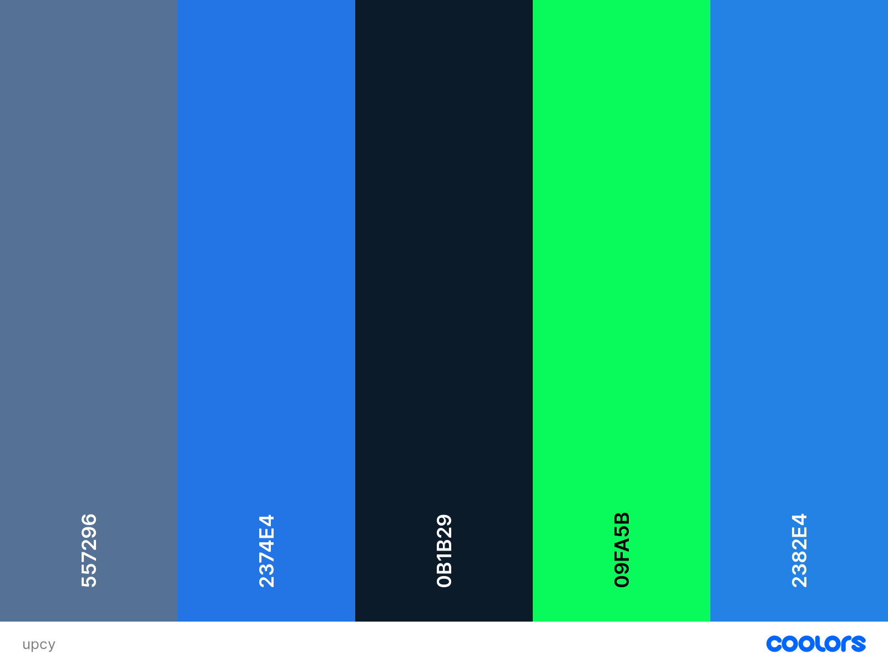

In [Part One](blog/2022-06-26-building-a-dao/index.md), ...

In [Part Two](blog/2022-06-29-building-a-dao-with-javascript-2/index.md) ... 

In this part, I've customized the [frontend of the dApp](https://upcy-dao.vercel.app/). 

I started with `public/index.html`

Here, I've 
- added a favicon
- changed the page title 
- changed the metadata for the
    - website 
    - twitter
    - facebook

Generated a color pallete from the DAO image using [coolers.co's image picker](https://coolors.co/image-picker) 

[CSS Background Pattern generator](https://www.magicpattern.design/tools/css-backgrounds)

Did some research on Design Trends for Web3

"A lot of apps built on blockchain (known as dApps) take with it the characteristics that blockchain embodies such as openness, security, fair distribution, community-driven and self-governing." (source: [uxdesign.cc](https://uxdesign.cc/designing-for-web-3-0-53ea939ac66))

"As blockchain becomes more mainstream, education will be needed less. But for now, companies are rightfully concentrating efforts in this space."
(source: [uxdesign.cc](https://uxdesign.cc/designing-for-web-3-0-53ea939ac66))

Design Inspiration

[afterparty.ai/](https://afterparty.ai/)

[llama.xyz/](https://llama.xyz/)

I wanted to add google fonts to figma
- Selected a font, then downloaded it 
- opened the desktop app, it appeared in the font selector   

"A favicon allows your site to be more recognizable in web browsers."
https://medium.com/amsterdam-standard/designing-favicons-importance-design-process-and-trends-2020-4d901270ba02